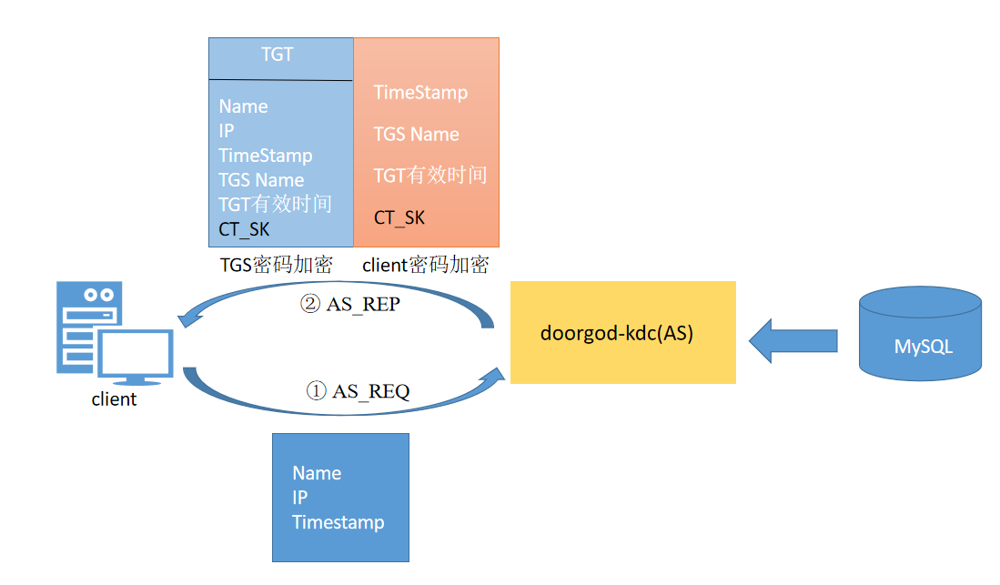

## 一. 概述

`Kerberos`是为`TCP/IP`网络系统设计的可信的第三方认证协议，用于**身份认证**。网络上的`Keberos`服务基于`DES`对称加密算法，但也可以用其他算法替代。因此，`Keberos`是一个在许多系统中获得广泛应用的认证协议。Keberos最初是美国麻省理工学院（`MIT`）为Athena项目开发的。

> [!TIP|style:flat|label:官网]
>
> https://www.kerberos.org/

### 1. 应用场景

`Kerberos`采用客户端/服务器（CS）结构与`DES`加密技术，并且能够进行相互认证，即客户端和服务器端均可对对方进行身份认证，是一种应用对称密钥体制进行密钥管理的系统。可以用于防止窃听、防止`replay`攻击、保护数据完整性等场合。

### 2. 功能特性

- 安全性

  `Kerberos`提供双向认证，不仅`Server`可以对`Client`进行认证，`Client`也能对`Server`进行认证。`Server`对`Client`认证成功之后，通过返回`Client`发送的时间戳，向`Client`提供验证自己身份的手段。

- 可靠性

  认证服务是其他服务的基础，服务认证过程有助于提升整个系统的可用性和高可靠性。

- 可扩展性

  `KDC`（秘钥分配中心）是秘钥体系的重要部分，旨在减少密钥体制所固有的交换密钥时所面临的风险。用户可以根据需要扩展多个`KDC`。

- 开放性

  `Kerberos`已经成为计算机领域一个被广泛接受的标准，所以使用`Kerberos`可以轻松实现不同平台之间的互操作。

## 二. Kerberos中的核心概念

Kerberos中有以下一些概念需要了解：

- **KDC**：密钥分发巾心，负责管理发放票据，记录授权。
- **Realm**：Kerberos管理领域的标识。
- **principal**：**Kerberos 下的用户可以称为 Principal**，当每添加一个用户或服务的时候都需要向kdc添加一条principal, principal的形式为：**主名称/实例名@领域名**。
- **主名称**：主名称可以是用户名或服务名，表示是用于提供各种网络服务(如`hdfs`、`yarn`,、`hive`） 的主体。
- **实例名**：实例名简单理解为主机名。
- **keytab文件**：存储了用户的加密密码。常用这种方式认证。

### 1. 用户principal

用户principal的形式：

> Name[/Instance]@REALM

其中`Instance`是可选 的，通常用于更好地限定用户的类型。比如，一个管理员用户通常会有admin instance，即`Name/admin@REALM`。

下面是指代用户的 一些principal的例子：

```ini
pippo@EXAMPLE.COM 
admin/admin@EXAMPLE.COM
cnicetoupp/admin@EXAMPLE.COM
```

### 2. 服务principal

用户principal的形式：

> Service/Hostname@REALM

- 第一部分是`service`的名字，比如`imap`， `AFS`， `ftp`。通常`host`这个名字被用于指明对一台机器的通用的访问(telnent， rsh， ssh)
- 第二个`component`是提供这个服务的机器的全限定域名(`FQDN`)。这个`component`跟`DNS`对应用服务器的IP地址进行逆向解析后得到的主机名。

下面是指代服务`principal`的例子：

```ini
imap/hadoop-node1@EXAMPLE.COM
host/hadoop-node1@EXAMPLE.COM
afs/hadoop-node1@EXAMPLE.COM
```

### 3. Ticket

`Ticket`分两种：

- `Ticket Granting Ticket，TGT`：这是KDC中的Authentication Server(简称AS)产生的，TGT是向Ticket Granting Server(TGS)用于表明自己真实身份的东西。
- `Service Ticket`：这是KDC中的Ticket Granting Server(简称TGS)产生的，Service Ticket 是用于向应用服务器表明自己身份的东西

## 三. Kerberos架构与工作原理

### 1. Kerberos请求流程

- `AS_REQ` 是在初始化一个用户（`kinit`）的时候发出的用户认证请求，这个请求是发给KDC中的Authentication Server (AS)；
- `AS_REP` 是 AS回复给client的信息，其中包括TGT (用TGS secret key加密过的) 和Client TGS Session Key (用发请求的用户的secret key加密过的);
- `TGS_REQ` 是client为了一个service ticket向Ticket Granting Server (TGS)的信息. 其中包括上一条信息中获得的TGT (用TGS secret key加密过的) ，一个客户端产生的一个authenticator(用Client TGS Session Key加密过的).
- `TGS_REP` 是TGS回复给TGS_REQ的信息. 其中包括service ticket（用appservice的secret key加密过），和 一个TGS产生的Client Server Session Key（之前AS产生的一条session key给加密过的）
- `AP_REQ` 是一条客户端发给appserver的访问服务的请求，其中包括service ticket和一个authenticator（使用TGS产生的Client Server Session Key加密过的）
- `AP_REP` 是appserver回复给client的一条信息，证明这个appserver确实是客户端希望访问的server。不过这条信息也不一定总是要回复的。比如当客户端和appserver需要相互认证的时候，客户端向appserver发出请求，这个时候就不需要回复信息。

### 2. Kerberos请求流程如图

 

 

### 3. Kerberos认证时序图

 

## 四. kerberos认证过程

### 1. 第一次通信

为了获得能够用来访问服务端服务的票据，客户端首先需要来到KDC获得服务授予票据（Ticket）。由于客户端是第一次访问KDC，此时KDC也不确定该客户端的身份，所以**第一次通信的目的为KDC认证客户端身份，确认客户端是一个可靠且拥有访问KDC权限的客户端**，过程如下：

 

**①** 客户端用户向KDC以明文的方式发起请求。该次请求中携带了自己的用户名，主机IP，和当前时间戳；

**②** KDC当中的AS（Authentication Server）接收请求（AS是KDC中专门用来认证客户端身份的认证服务器）后去kerberos认证数据库中根据用户名查找是否存在该用户，此时只会查找是否有相同用户名的用户，并不会判断身份的可靠性；

**③** 如果没有该用户名，认证失败，服务结束；如果存在该用户名，则AS认证中心便认为用户存在，此时便会返回响应给客户端，其中包含两部分内容：

- 第一部分内容称为TGT，他叫做票据授予票据，客户端需要使用TGT去KDC中的TGS（票据授予中心）获取访问网络服务所需的Ticket（服务授予票据），TGT中包含的内容有kerberos数据库中存在的该客户端的Name，IP，当前时间戳，客户端即将访问的TGS的Name，TGT的有效时间以及一把用于客户端和TGS间进行通信的Session_key(CT_SK)。整个TGT使用TGS密钥加密，客户端是解密不了的，由于密钥从没有在网络中传输过，所以也不存在密钥被劫持破解的情况。
- 第二部分内容是使用客户端密钥加密的一段内容，其中包括用于客户端和TGS间通信的Session_key(CT_SK),客户端即将访问的TGS的Name以及TGT的有效时间，和一个当前时间戳。该部分内容使用客户端密钥加密，所以客户端在拿到该部分内容时可以通过自己的密钥解密。如果是一个假的客户端，那么他是不会拥有真正客户端的密钥的，因为该密钥也从没在网络中进行传输过。这也同时认证了客户端的身份，如果是假客户端会由于解密失败从而终端认证流程。

至此，第一次通信完成。

### 2. 第二次通信

此时的客户端收到了来自KDC（其实是AS）的响应，并获取到了其中的两部分内容。此时客户端会用自己的密钥将第二部分内容进行解密，分别获得时间戳，自己将要访问的TGS的信息，和用于与TGS通信时的密钥CT_SK（Client TGS Session Key）。

首先他会根据时间戳判断该时间戳与自己发送请求时的时间之间的差值是否大于5分钟，如果大于五分钟则认为该AS是伪造的，认证至此失败。如果时间戳合理，客户端便准备向TGS发起请求。

其次**请求的主要目的是为了获取能够访问目标网络服务的服务授予票据Ticket**（进入动物园需要的门票）。 在第二次通信请求中，客户端将携带三部分内容交给KDc中的TGS。

第二次通信过程具体如下所述：

  

客户端行为：

**①** 客户端使用CT_SK加密将自己的客户端信息发送给KDC，其中包括客户端名，IP，时间戳；

**②** 客户端将自己想要访问的Server服务以明文的方式发送给KDC；

**③** 客户端将使用TGS密钥加密的TGT也原封不动的也携带给KDC；

TGS行为：

**①** 此时KDC中的TGS（票据授予服务器）收到了来自客户端的请求。他首先根据客户端明文传输过来的Server服务IP查看当前kerberos系统中是否存在可以被用户访问的该服务。如果不存在，认证失败结束，。如果存在，继续接下来的认证。

**②** TGS使用自己的密钥将TGT中的内容进行解密，此时他看到了经过AS认证过后并记录的用户信息，一把Session_KEY即CT_SK，还有时间戳信息，他会现根据时间戳判断此次通信是否真是可靠有无超出时延。

**③** 如果时延正常，则TGS会使用CK_SK对客户端的第一部分内容进行解密（使用CT_SK加密的客户端信息），取出其中的用户信息和TGT中的用户信息进行比对，如果全部相同则认为客户端身份正确，方可继续进行下一步。

**④** 此时KDC将返回响应给客户端，响应内容包括：

- 第一部分：用于客户端访问网络服务的使用Server密码加密的ST（Servre Ticket），其中包括客户端的Name，IP，需要访问的网络服务的地址Server IP，ST的有效时间，时间戳以及用于客户端和服务端之间通信的CS_SK（Session Key）。
- 第二部分：使用CT_SK加密的内容，其中包括CS_SK和时间戳，还有ST的有效时间。由于在第一次通信的过程中，AS已将CT_SK通过客户端密码加密交给了客户端，且客户端解密并缓存了CT_SK，所以该部分内容在客户端接收到时是可以自己解密的。

至此，第二次通信完成。

### 3. 第三次通信

此时的客户端收到了来自KDC（TGS）的响应，并使用缓存在本地的CT_SK解密了第二部分内容（第一部分内容中的ST是由Server密码加密的，客户端无法解密），检查时间戳无误后取出其中的CS_SK准备向服务端发起最后的请求。

 

客户端：

**①** 客户端使用CK_SK将自己的主机信息和时间戳进行加密作为交给服务端的第一部分内容，然后将ST（服务授予票据）作为第二部分内容都发送给服务端。

服务端：

**①** 服务器此时收到了来自客户端的请求，他会使用自己的密钥，即Server密钥将客户端第二部分内容进行解密，核对时间戳之后将其中的CS_SK取出，使用CS_SK将客户端发来的第一部分内容进行解密，从而获得经过TGS认证过后的客户端信息，此时他将这部分信息和客户端第二部分内容带来的自己的信息进行比对，最终确认该客户端就是经过了KDC认证的具有真实身份的客户端，是他可以提供服务的客户端。此时服务端返回一段使用CT_SK加密的表示接收请求的响应给客户端，在客户端收到请求之后，使用缓存在本地的CS_ST解密之后也确定了服务端的身份（其实服务端在通信的过程中还会使用数字证书证明自己身份）。

至此，第三次通信完成。此时也代表着整个kerberos认证的完成，通信的双方都确认了对方的身份，此时便可以放心的进行整个网络通信了。

## 五. 高可用集群部署

### 1. 环境规划

| IP         | hostname | 角色           | 组件                                   |
| ---------- | -------- | -------------- | -------------------------------------- |
| 10.10.10.3 | hadoop1  | Master，Client | krb5-server krb5-workstation krb5-libs |
| 10.10.10.4 | hadoop2  | Slaver，Client | krb5-server krb5-workstation krb5-libs |
| 10.10.10.5 | hadoop3  | Client         | krb5-workstation krb5-libs             |

### 2. 准备工作

#### 2.1 修改hostname

```bash
[root@hadoop3 ~]# vim /etc/hostname 
hadoop1
#或者是通过以下命令也可以修改hostname
[root@hadoop3 ~]# hostnamectl hadoop1
```

#### 2.2 修改hosts配置

```bash
[root@hadoop3 ~]# vim /etc/hosts
10.10.10.3 hadoop1
10.10.10.4 hadoop2
10.10.10.5 hadoop3
```

#### 2.3 ssh免密登录

```bash
# 在本机生成非对称密钥
[root@hadoop3 ~]# ssh-keygen
Enter passphrase (empty for no passphrase): 
Enter same passphrase again: 
Your identification has been saved in /root/.ssh/id_rsa.
Your public key has been saved in /root/.ssh/id_rsa.pub.
The key fingerprint is:
SHA256:DuGJdvNDDXvXVehdVnCZ3zSGMKIXxnuCz1sQUi00FBo root@hadoop1
The key's randomart image is:
+---[RSA 2048]----+
|       E=Xoo. ooB|
|       .=++....*=|
|      .o+.+  ..+*|
|     o +.B . ...+|
|    o * S * . .  |
|   . . * + o     |
|        + o      |
|         o       |
|                 |
+----[SHA256]-----+
# 查看生成的密钥
[root@hadoop3 ~]# ll
总用量 16
-rw-------. 1 root root  987 10月 31 16:32 authorized_keys
-rw-------. 1 root root 1679 11月  9 16:05 id_rsa
-rw-r--r--. 1 root root  394 11月  9 16:05 id_rsa.pub
-rw-r--r--. 1 root root  532 11月  2 09:49 known_hosts
# 复制公钥到其他机器
[root@hadoop3 ~]# ssh-copy-id -i ~/.ssh/id_rsa.pub  root@hadoop2
/usr/bin/ssh-copy-id: INFO: Source of key(s) to be installed: "id_rsa.pub"
/usr/bin/ssh-copy-id: INFO: attempting to log in with the new key(s), to filter out any that are already installed
/usr/bin/ssh-copy-id: INFO: 1 key(s) remain to be installed -- if you are prompted now it is to install the new keys
root@hadoop2's password:
```

#### 2.4 安装ntp服务

参考[Linux时钟同步](ProjectDocs/operations/time-sync.md)章节


### 3. 安装Kerberos

#### 3.1 安装Kerberos主节点

- hadoop1节点为主节点，需安装服务端和客户端

  ```bash
  [root@hadoop3 ~]# yum -y install krb5-server krb5-workstation krb5-libs
  ```

- hadoop2节点为从节点，需安装服务端和客户端

  ```bash
  [root@hadoop3 ~]# yum -y install krb5-server krb5-workstation krb5-libs
  ```

- hadoop3安装客户端，只需安装客户端即可

  ```bash
  [root@hadoop3 ~]# yum -y install krb5-workstation krb5-libs
  ```

#### 3.2 配置Kerberos服务相关文件

- 修改`krb5.conf`

  ```bash
  [root@hadoop3 ~]# mkdir -p /var/log/kerberos
  [root@hadoop3 ~]# vim etc/krb5.conf
  # Configuration snippets may be placed in this directory as well
  includedir /etc/krb5.conf.d/
  
  # 块配置日志相关
  [logging]
   # 默认的krb5libs.log日志文件存放路径
   default = FILE:/var/log/kerberos/krb5libs.log
   # 默认的krb5kdc.log日志文件存放路径
   kdc = FILE:/var/log/kerberos/krb5kdc.log
   # 默认的kadmind.log日志文件存放路径
   admin_server = FILE:/var/log/kerberos/kadmind.log
  
  # 配置默认的设置
  [libdefaults]
   # DNS查找域名，我们可以理解为DNS的正向解析，默认禁用。
   dns_lookup_realm = false
   # 凭证生效的时限，设置为24h。
   ticket_lifetime = 24h
   # 凭证最长可以被延期的时限，一般为7天。当凭证过期之后，对安全认证的服务的后续访问则会失败。
   renew_lifetime = 7d
   # 如果此参数被设置为true，则可以转发票据，这意味着如果具有TGT的用户登陆到远程系统，则KDC可以颁发新的TGT，而不需要用户再次进行身份验证。
   forwardable = true
  #  rdns = false
   pkinit_anchors = FILE:/etc/pki/tls/certs/ca-bundle.crt
  # 默认的realm。如 HADOOP.COM，当客户端在连接或者获取主体的时候，当没有输入领域的时候，该值为默认值(列如：使用kinit admin/admin 获取主体的凭证时，没有输入领域，而传到kdc服务器的时候，会变成 admin/admin@HADOOP.COM )
   default_realm = HADOOP.COM
  #  default_ccache_name = KEYRING:persistent:%{uid}
  
  # 表示一个公司或者一个组织。逻辑上的授权认证范围，可以配置多个realm
  [realms]
  HADOOP.COM = {
   # kdc服务器地址。格式[主机名或域名]:端口， 默认端口是88，默认端口可不写
   kdc = hadoop1
   #添加从节点host
   kdc = hadoop2
   # admin服务地址 格式[主机名或域名]:端口， 默认端口749，默认端口可不写
   admin_server = hadoop1
   # 代表默认的域名，设置Server主机所对应的域名
   default_domain = hadoop1.com
  }
  
  # 指定DNS域名和Kerberos域名之间映射关系。指定服务器的FQDN，对应的domain_realm值决定了主机所属的域。
  [domain_realm]
  .hadoop1.com = HADOOP.COM
  hadoop1.com = HADOOP.COM
  
  # kdc的配置信息。即指定kdc.conf的位置。
  [kdc]
   # kdc的配置文件路径，默认没有配置，如果是默认路径，可以不写
   profile = /var/kerberos/krb5kdc/kdc.conf
  ```

- 修改`kdc.conf`

  ```bash
  [root@hadoop3 ~]# vi /var/kerberos/krb5kdc/kdc.conf
  [kdcdefaults]
   # 指定KDC的默认端口
   kdc_ports = 88
   # 指定KDC的TCP协议默认端口。
   kdc_tcp_ports = 88
  
  [realms]
   # 该部分列出每个领域的配置。
   HADOOP.COM = {
    # 和supported_enctypes默认使用 aes256-cts。由于，JAVA 使用 aes256-cts 验证方式需要安装额外的 jar 包（后面再做说明）。推荐不使用，并且删除 aes256-cts。（建议注释掉，默认也是注释掉的）
    #master_key_type = aes256-cts
    # 标注了admin的用户权限的文件，若文件不存在，需要用户自己创建。即该参数允许为具有对Kerberos数据库的管理访问权限的UPN指定ACL。
    acl_file = /var/kerberos/krb5kdc/kadm5.acl
    # 该参数指向包含潜在可猜测或可破解密码的文件。
    dict_file = /usr/share/dict/words
    # KDC 进行校验的 keytab。
    admin_keytab = /var/kerberos/krb5kdc/kadm5.keytab
    # ticket 的默认生命周期为24h
    max_file = 24h
    # 该参数指定在多长时间内可重获取票据，默认为0
    max_renewable_life = 7d
    # 指定此KDC支持的各种加密类型。
    supported_enctypes = aes256-cts:normal aes128-cts:normal des3-hmac-sha1:normal arcfour-hmac:normal camellia256-cts:normal camellia128-cts:normal des-hmac-sha1:normal des-cbc-md5:normal des-cbc-crc:normal
   }
  ```

- 修改`kadm5.acl`

  > [!TIP]
  >
  > `/var/kerberos/krb5kdc/kadm5.acl`：权限相关配置
  
  ```bash
  [root@hadoop3 ~]# vi /var/kerberos/krb5kdc/kadm5.acl
  */admin@HADOOP.COM	*
  ```
  
  第一列： `*/admin@HADOOP.COM`  对应  `Kerberos_principal`  表示主体(`principal`)名称
  
  第二列：`*` 对应 `permissions`  表示权限
  
  > [!TIP]
  >
  > 该配置文件主要是用于管理员登陆的acl配置格式，上述的配置表示以`/admin@HADOOP.COM`结尾的用户拥有`*`(`all` 也就是所有)权限，具体配置可根据项目来是否缩小权限。
  >
  > 权限如下：
  >
  > - a:[不]允许添加主体或策略。
  > - d:[不]允许删除主体或策略。
  > - m:[不]允许修改主体或策略。
  > - c:[不]允许更改主体的口令。
  > - i:[不]允许查询 Kerberos 数据库。
  >
  > - l:[不]允许列出 Kerberos 数据库中的主体或策略。
  > - x或 *:允许所有权限。

#### 3.3 创建Kerberos数据库

- 初始化数据库

  ```bash
  # 该命令会在 /var/kerberos/krb5kdc/ 目录下创建 principal 数据库
  [root@hadoop3 ~]# kdb5_util create -s -r HADOOP.COM
  [root@hadoop3 ~]# ll
  总用量 32
  -rw-------. 1 root root 16384 11月  8 15:13 principal
  -rw-------. 1 root root  8192 11月  3 15:48 principal.kadm5
  -rw-------. 1 root root     0 11月  3 15:48 principal.kadm5.lock
  -rw-------. 1 root root     0 11月  8 15:13 principal.ok
  ```

  >  [!TIP]
  >
  >  -r 指定域名(也就是在krb5.conf文件[realms]组里面定义的域名) 
  >
  >  -s 选项指定将数据库的主节点密钥存储在文件中，从而可以在每次启动KDC时自动重新生成主节点密钥，生成 stash file，并在其中存储 master server key（krb5kdc）

- 创建好数据库后重启kdc，并设置开机启动

  ```bash
  [root@hadoop3 ~]# systemctl start krb5kdc
  [root@hadoop3 ~]# systemctl status krb5kdc
  [root@hadoop3 ~]# systemctl enable krb5kdc #开启自启
  #修改配置文件后重启krb5kdc时需要刷新配置
  [root@hadoop3 ~]# systemctl daemon-reload
  
  [root@hadoop3 ~]# systemctl start kadmin
  [root@hadoop3 ~]# systemctl status kadmin
  [root@hadoop3 ~]# systemctl enable kadmin #开启自启
  
  #记得关闭防火墙
  [root@hadoop3 ~]# systemctl status firewalld
  [root@hadoop3 ~]# systemctl stop firewalld
  [root@hadoop3 ~]# systemctl status firewalld
  ```


#### 3.4 创建 kerberos的管理员

```bash
[root@hadoop3 ~]# kadmin.local 
Authenticating as principal admin/admin@HADOOP.COM with password.
kadmin.local:  addprinc admin/admin@HADOOP.COM
```

#### 3.5 生成kerberos管理员密钥文件

```bash
[root@hadoop3 ~]# kadmin.local 
Authenticating as principal admin/admin@HADOOP.COM with password.
kadmin.local:  xst -norandkey -k /var/kerberos/krb5kdc/keytab/admin.keytab  admin/admin@HADOOP.COM
```

> [!TIP]
>
> -k 指定keytab文件的位置
>
> -norandkey 表示生成keytab文件时不更新密码，还是用原来的密码

#### 3.6 安装Kerberos从节点

1. 安装Kerberos服务端和客户端

   ```bash
   [root@hadoop3 ~]# yum -y install krb5-server krb5-workstation krb5-libs
   ```

2. 将master上的几个文件拷贝到slave服务器

   ```bash
   #  krb5.conf、kdc.conf、kadmin5.acl、master key stash file
   [root@hadoop3 ~]# rsync /etc/krb5.conf hadoop2:/etc/
   [root@hadoop3 ~]# rsync /var/kerberos/krb5kdc/kadm5.acl hadoop2:/var/kerberos/krb5kdc/
   [root@hadoop3 ~]# rsync /var/kerberos/krb5kdc/kdc.conf hadoop2:/var/kerberos/krb5kdc/
   [root@hadoop3 ~]# scp /var/kerberos/krb5kdc/.k5.HADOOP.COM hadoop2:/var/kerberos/krb5kdc/
   ```

3. 在master节点上生成master、slave节点的凭证，并复制host.keytab到slave节点

   ```bash
   [root@hadoop3 ~]# kadmin.local 
   Authenticating as principal admin/admin@HADOOP.COM with password.
   kadmin.local:  addprinc host/hadoop1 #生成master节点的host凭证，hadoop1是master的hostname
   kadmin.local:  xst -norandkey -k /var/kerberos/krb5kdc/keytab/host.keytab host/hadoop1
   kadmin.local:  addprinc host/hadoop2 #生成master节点的host凭证，hadoop2是slave的hostname
   kadmin.local:  xst -norandkey -k /var/kerberos/krb5kdc/keytab/host.keytab host/hadoop2
   # 凭证和keytab文件生成完成后通过kadmin.local: q退出kadmin命令
   # 复制host.keytab文件到slave节点
   [root@hadoop3 ~]# scp /var/kerberos/krb5kdc/keytab/host.keytab hadoop2:/var/kerberos/krb5kdc/keytab/
   ```

4. 在slave上创建数据库

   ```bash
   [root@hadoop3 ~]# kdb5_util create -s -r HADOOP.COM
   Loading random data
   Initializing database '/var/kerberos/krb5kdc/principal' for realm 'HADOOP.COM',
   master key name 'K/M@HADOOP.COM'
   You will be prompted for the database Master Password.
   It is important that you NOT FORGET this password.
   Enter KDC database master key: 
   Re-enter KDC database master key to verify:
   ```

5. 在slave服务器上创建kpropd.acl文件，并配置上host的主体

   ```bash
   [root@hadoop3 ~]# vim /var/kerberos/krb5kdc/kpropd.acl
   host/hadoop1@HADOOP.COM
   host/hadoop2@HADOOP.COM
   ```

6. 在slave上启动kpropd服务

   ```bash
   # 修改KPROPD_ARGS参数，设置自定义的host.keytab文件，默认为/etc/krb5.keytab
   [root@hadoop3 ~]# vim /etc/sysconfig/kprop
   KPROPD_ARGS=-s /var/kerberos/krb5kdc/keytab/host.keytab
   
   #启动kprop并设置开机启动
   [root@hadoop3 ~]# systemctl daemon-reload
   [root@hadoop3 ~]# systemctl start kprop
   [root@hadoop3 ~]# systemctl status kprop
   [root@hadoop3 ~]# systemctl enable kprop
   ```

7. 在master上将相关数据同步到slave上

   ```bash
   #备份数据库
   [root@hadoop3 ~]# kdb5_util dump /var/kerberos/krb5kdc/dump/kdc.dump
   #同步到slave节点
   [root@hadoop1 keytab]# kprop -f /var/kerberos/krb5kdc/dump/kdc.dump -s /var/kerberos/krb5kdc/keytab/host.keytab  hadoop2
   Database propagation to hadoop2: SUCCEEDED
   ```

8. slave上/var/kerberos/krb5kdc/会多出一些文件

   ```bash
   [root@hadoop2 krb5kdc]# ls -la
   总用量 60
   drwxr-xr-x. 3 root root   200 11月  9 15:45 .
   drwxr-xr-x. 4 root root    33 11月  9 10:27 ..
   -rw-------. 1 root root 15341 11月  9 15:45 from_master
   -rw-------. 1 root root    75 11月  9 14:52 .k5.HADOOP.COM
   -rw-------. 1 root root    21 11月  9 10:40 kadm5.acl
   -rw-------. 1 root root   450 11月  9 10:41 kdc.conf
   drwxr-xr-x. 2 root root    25 11月  9 15:11 keytab
   -rw-r--r--. 1 root root    48 11月  9 11:13 kpropd.acl
   -rw-------. 1 root root 20480 11月  9 15:45 principal
   -rw-------. 1 root root  8192 11月  9 15:45 principal.kadm5
   -rw-------. 1 root root     0 11月  9 14:42 principal.kadm5.lock
   -rw-------. 1 root root     0 11月  9 15:45 principal.ok
   
   ```

9. 至此，可以启动slave上的kdc服务

   ```bash
   #修改配置文件后重启krb5kdc时需要刷新配置
   [root@hadoop3 ~]# systemctl daemon-reload
   [root@hadoop3 ~]# systemctl start krb5kdc
   [root@hadoop3 ~]# systemctl status krb5kdc
   [root@hadoop3 ~]# systemctl enable krb5kdc #开启自启
   ```

10. 测试主从是否生效(成功)

    a. 将master节点的keytab文件都拷贝到客户端

    b. 通过kinit命令来查验keytab是否可以正常验证

    ```bash
    [root@hadoop3 ~]# kinit -kt /var/kerberos/krb5kdc/keytab/hdfs.keytab hdfs/hadoop3
    ```

    轮流停掉master、slave节点的kdc服务，然后在客户端通过kinit命令来验证是否生效

11. 常见问题

    - kprop: 没有那个文件或目录

      ```bash
      [root@hadoop3 ~]# kprop -f /var/kerberos/krb5kdc/dump/kdc.dump hadoop2
      kprop: 没有那个文件或目录 while getting initial credentials
      # 因为在/etc/目录下，找不到host/hadoop1和host/hadoop2的keytab文件（krb5.keytab），所以会报这个错，通过-s指定keytab文件
      [root@hadoop3 ~]# kprop -f /var/kerberos/krb5kdc/dump/kdc.dump -s /var/kerberos/krb5kdc/keytab/host.keytab  hadoop2
      Database propagation to hadoop2: SUCCEEDED
      ```

    - Server rejected authentication

      ```bash
      kprop: Server rejected authentication (during sendauth exchange) while authenticating to server
      kprop: Service key not available signalled from server
      Error text from server: Service key not available
      # 该问题是因为slave节点的/etc目录下没有krb5.keytab文件，以下命令可解决
      [root@hadoop3 ~]# scp /var/kerberos/krb5kdc/keytab/host.keytab hadoop2:/etc/krb5.keytab
      # 或者用以下方法来解决，从kprop.service得知kprop启动是由/usr/sbin/kpropd命令启动的，查看命令
      # /usr/sbin/kpropd -h
      # Usage: /usr/sbin/kpropd [-r realm] [-s srvtab] [-dS] [-f slave_file]
      # 	[-F kerberos_db_file ] [-p kdb5_util_pathname]
      # 	[-x db_args]* [-P port] [-a acl_file]
      # 	[-A admin_server]
      # kprop.service启动的时候会给定一个KPROPD_ARGS参数
      # 通过kpropd -h得知kprop是通过-s来指定自定义的keytab文件，因此可以修改/etc/sysconfig/kprop下的KPROPD_ARGS参数，加上-s /var/kerberos/krb5kdc/keytab/host.keytab即可
      [root@hadoop3 ~]# vim /etc/sysconfig/kprop
      KPROPD_ARGS=-s /var/kerberos/krb5kdc/keytab/host.keytab
      ```

    - slave节点的kdc服务启动报错

      ```bash
      krb5kdc: Unable to decrypt latest master key with the provided master key
       - while fetching master keys list for realm HADOOP.COM
      #该问题是由备节点使用的不是主节点拷贝过来的.k5.CC.LOCAL，以下命令可解决
      [root@hadoop3 ~]# rsync .k5.HADOOP.COM hadoop2:/var/kerberos/krb5kdc/
      ```


#### 3.7 kerberos常用命令

- **添加主体(principal)**

  以下这几个命令都可以创建主体(相当于用户)

  ```bash
  add_principal, addprinc, ank 
  # 服务器操作测试：
  kadmin.local 进入到控制台控制台是以kadmin.local开头的，如下：
  kadmin.local: addprinc hdfs/hadoop1    #创建主体(用户)yjt/yjt 需要输入密码
  kadmin.local: addprinc -pw 123456 hdfs/hadoop1 # 创建yjt/yjt主体，密码使用-pw指定
  kadmin.local: addprinc -randkey hdfs/hadoop1 #生成随机密码
  ```

- **删除主体**

  删除主体，删除的时候会询问是否删除

  ```bash
  delete_principal, delprinc
  # 服务器操作测试：
  kadmin.local: delprinc hdfs/hadoop1
  ```

- **修改凭证**

  修改用户，比如修改延迟到期时间

  ```bash
  modify_principal, modprinc
  # 服务器操作测试：
  kadmin.local: modprinc hdfs/hadoop1
  ```


- **列出当前凭证**

  列出当前凭证

  ```bash
  list_principals, listprincs, get_principals, getprincs
  # 服务器操作测试：
  kadmin.local: listprincs
  ```


- **获取凭据信息**

  获取凭据信息的两个命令

  ```bash
  get_principal, getprinc
  # 服务器操作测试：
  kadmin.local: getprinc hdfs/hadoop1
  ```


- **生成dump文件**

  生成当前Kerberos数据库的备份文件，如主从同步时可以使用该命令来备份数据库，再通过kprop来恢复

  ```bash
  [root@hadoop3 ~]# kdb5_util dump /var/kerberos/krb5kdc/kdc.dump
  [root@hadoop3 ~]# ll
  总用量 20
  -rw-------. 1 root root 13204 11月  9 10:18 kdc.dump
  -rw-------. 1 root root     1 11月  9 10:18 kdc.dump.dump_ok
  ```


- **修改认证主体的密码**

  ```bash
  [root@hadoop3 ~]# kpasswd hdfs/hadoop1
  ```


- **获取凭证**

  ```bash
  [root@hadoop3 ~]# kinit  hdfs/hadoop1    #基于密码，需要输入密码
  [root@hadoop3 ~]# kinit -kt hdfs.keytab hdfs/hadoop1    #基于keytab文件
  ```


- **查看当前的凭证**

  ```bash
  [root@hadoop3 ~]# klist 
  Ticket cache: FILE:/tmp/krb5cc_0
  Default principal: nm/yjt@HADOOP.COM
  ```

- **删除当前认证的缓存**

  ```bash
  [root@hadoop3 ~]# kdestroy 
  ```


- **查看密钥文件的认证主体列表**

  ```bash
  [root@hadoop3 ~]# klist -ket hdfs.keytab 
  Keytab name: FILE:hdfs.keytab
  ```

#### 3.8 主体票据有效期修改

- 修改client端的`/etc/krb5.conf`

  ```ini
  ticket_lifetime = 24h
  renew_lifetime = 180d
  ```

- 修改server端的`/var/kerberos/krb5kdc/kdc.conf`

  ```ini
  max_life = 1d 0h 0m 0s
  max_renewable_life = 180d 0h 0m 0s
  ```

- 然后修改krbtgt账号和业务账号的`maxlife`和`maxrenewlife`的值

  ```shell
  modprinc -maxlife 1d -maxrenewlife 180d +allow_renewable krbtgt/CQ.CTC.COM@CQ.CTC.COM
  modprinc -maxlife 1d -maxrenewlife 180d +allow_renewable flink/emrint01@CQ.CTC.COM
  modprinc -maxlife 1d -maxrenewlife 180d +allow_renewable flink/emrint02@CQ.CTC.COM
  ```

- 手动刷新设置`renewable_lifetime` 

  ```shell
  kinit -r 80days
  ```

  

