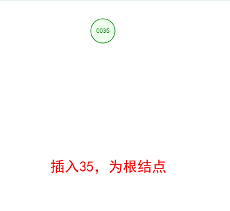

## MySQL索引

### 索引分类

| 存储结构上来划分            | 应用层次上来划分                                             | 表记录和索引的排列顺序划分                           |
| --------------------------- | ------------------------------------------------------------ | ---------------------------------------------------- |
| Btree 索引（B+tree，B-tree) | 普通索引：即一个索引只包含单个列，一个表可以有多个单列索引。 | 聚集索引：表记录的排列顺序和索引的排列顺序一致。     |
| Hash 哈希索引               | 唯一索引：索引列的值必须唯一，但允许有空值。                 | 非聚集索引：表记录的排列顺序和索引的排列顺序不一致。 |
| full-index 全文索引         | 复合索引：一个索引包含多个列。                               |                                                      |

### 索引数据结构

#### 二叉树

**二叉树特性**：

  > 1、每个结点都包含一个元素以及n个子树，这里0≤n≤2。
  >
  > 2、左子树和右子树是有顺序的，次序不能任意颠倒。左子树的值要小于父结点，右子树的值要大于父结点。

假设我们现在有这样一组数[35 27 48 12 29 38 55]，顺序的插入到一个数的结构中，步骤如下：

  

   

  

   

我们能看到，经通过一系列的插入操作之后，原本无序的一组数已经变成一个有序的结构了，并且这个树满足了上面提到的两个二叉树的特性！但是如果同样是上面那一组数，我们自己升序排列后再插入，也就是说按照[12 27 29 35 38 48 55]的顺序插入，会怎么样呢？

 

由于是升序插入，新插入的数据总是比已存在的结点数据都要大，所以每次都会往结点的右边插入，最终导致这棵树严重偏科！！！上图就是最坏的情况，也就是一棵树退化为一个线性链表了，这样查找效率自然就低了，完全没有发挥树的优势！为了较大发挥二叉树的查找效率，让二叉树不再偏科，保持各科平衡，所以有了平衡二叉树！

#### 平衡二叉树

**平衡二叉树特性**：

  >1、平衡二叉树是一种特殊的二叉树，所以他也满足前面说到的二叉树的两个特性
  >
  >2、它的左右两个子树的高度差的绝对值不超过1，并且左右两个子树都是一棵平衡二叉树。
  >
  >3、[平衡二叉树测试链接](https://www.cs.usfca.edu/~galles/visualization/AVLtree.html)

大家也看到了前面[35 27 48 12 29 38 55]插入完成后的图，其实就已经是一颗平衡二叉树啦。那如果按照[12 27 29 35 38 48 55]的顺序插入一颗平衡二叉树，会怎么样呢？我们看看插入以及平衡的过程：

  

 

  

 

#### B-树

#### B+数

#### B-Tree or B+Tree

#### InnoDB引擎数据存储

#### 聚集索引与非聚集索引

#### InnoDB与MyISAM存储引擎对比

为什么索引结构默认使用B+树，而不是B-Tree，Hash哈希，二叉树，红黑树？
