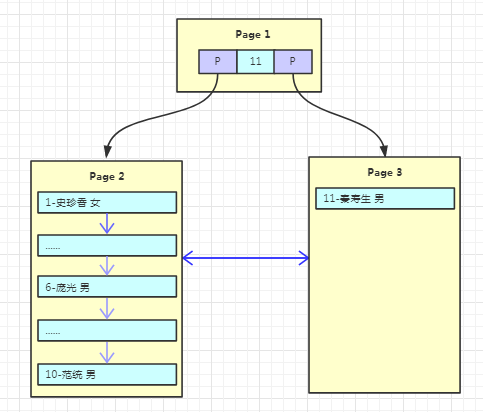
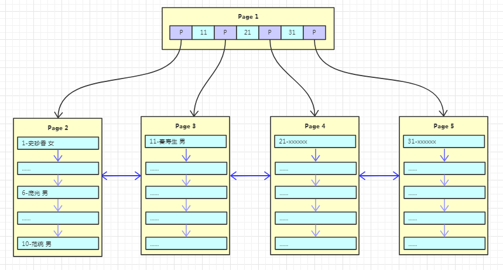
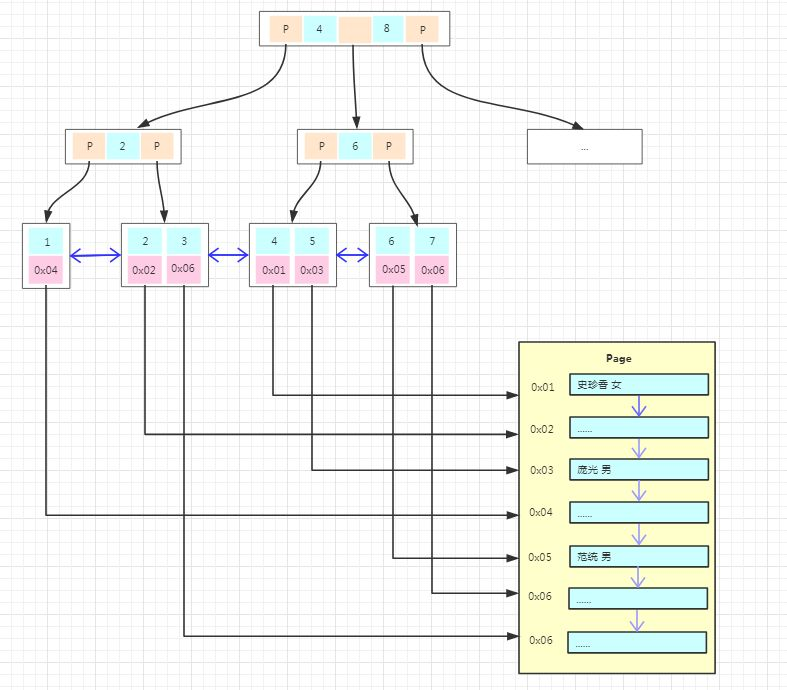
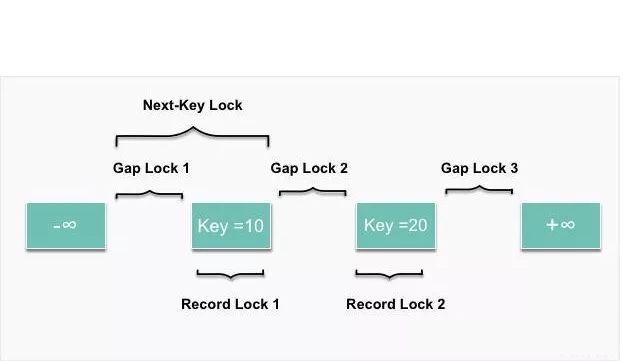
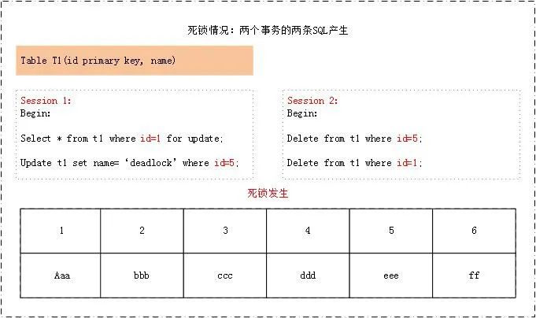
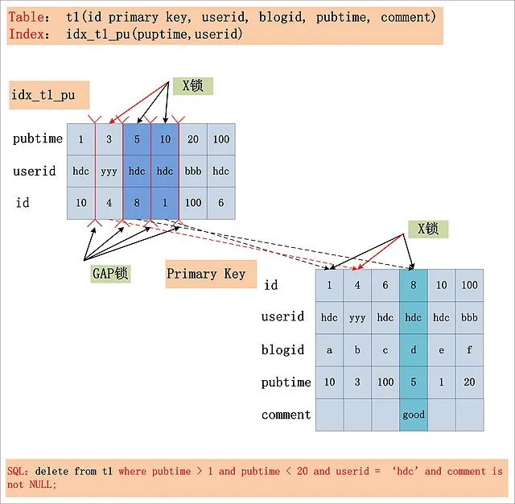
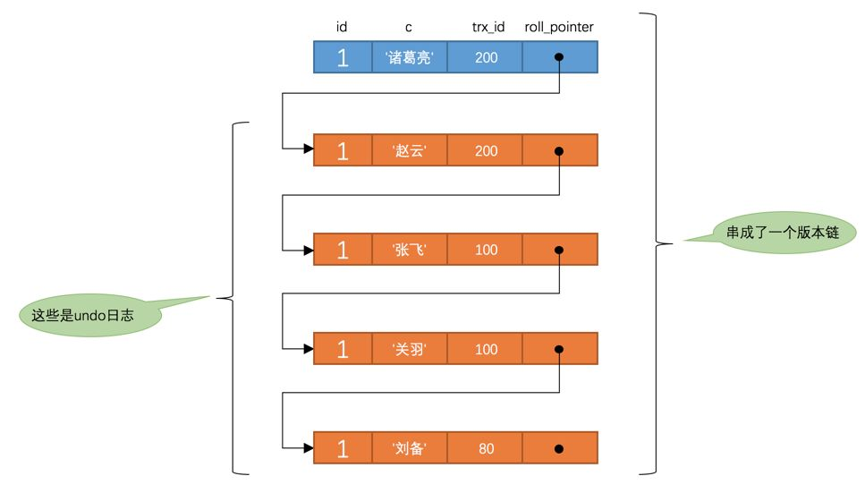

## MySQL索引

### 索引分类

| 存储结构上来划分            | 应用层次上来划分                                             | 表记录和索引的排列顺序划分                           |
| --------------------------- | ------------------------------------------------------------ | ---------------------------------------------------- |
| Btree 索引（B+tree，B-tree) | 普通索引：即一个索引只包含单个列，一个表可以有多个单列索引。 | 聚集索引：表记录的排列顺序和索引的排列顺序一致。     |
| Hash 哈希索引               | 唯一索引：索引列的值必须唯一，但允许有空值。                 | 非聚集索引：表记录的排列顺序和索引的排列顺序不一致。 |
| full-index 全文索引         | 复合索引：一个索引包含多个列。                               |                                                      |

### 索引数据结构

#### 二叉树

**二叉树特性**：

  > 1、每个结点都包含一个元素以及n个子树，这里0≤n≤2。
  >
  > 2、左子树和右子树是有顺序的，次序不能任意颠倒。左子树的值要小于父结点，右子树的值要大于父结点。

假设我们现在有这样一组数[35 27 48 12 29 38 55]，顺序的插入到一个数的结构中，步骤如下：

  

   

  

   

我们能看到，经通过一系列的插入操作之后，原本无序的一组数已经变成一个有序的结构了，并且这个树满足了上面提到的两个二叉树的特性！但是如果同样是上面那一组数，我们自己升序排列后再插入，也就是说按照[12 27 29 35 38 48 55]的顺序插入，会怎么样呢？

 

由于是升序插入，新插入的数据总是比已存在的结点数据都要大，所以每次都会往结点的右边插入，最终导致这棵树严重偏科！！！上图就是最坏的情况，也就是一棵树退化为一个线性链表了，这样查找效率自然就低了，完全没有发挥树的优势！为了较大发挥二叉树的查找效率，让二叉树不再偏科，保持各科平衡，所以有了平衡二叉树！

#### 平衡二叉树

**平衡二叉树特性**：

  >1、平衡二叉树是一种特殊的二叉树，所以他也满足前面说到的二叉树的两个特性
  >
  >2、它的左右两个子树的高度差的绝对值不超过1，并且左右两个子树都是一棵平衡二叉树。
  >
  >3、[平衡二叉树测试链接](https://www.cs.usfca.edu/~galles/visualization/AVLtree.html)

大家也看到了前面[35 27 48 12 29 38 55]插入完成后的图，其实就已经是一颗平衡二叉树啦。那如果按照[12 27 29 35 38 48 55]的顺序插入一颗平衡二叉树，会怎么样呢？我们看看插入以及平衡的过程：

  

 

  

 

这棵树始终满足平衡二叉树的几个特性而保持平衡！这样我们的树也不会退化为线性链表了！我们需要查找一个数的时候就能沿着树根一直往下找，这样的查找效率和二分法查找是一样！

一颗平衡二叉树能容纳多少的结点呢？这跟树的高度是有关系的，假设树的高度为h，那每一层最多容纳的结点数量为2^(h-1)，整棵树最多容纳节点数2^0+2^1+2^2+...+2^(h-1)。这样计算，100w数据树的高度大概在20左右，那也就是说从有着100w条数据的平衡二叉树中找一个数据，最坏的情况下需要20次查找。如果是内存操作，效率也是很高的！但是我们数据库中的数据基本都是放在磁盘中的，每读取一个二叉树的结点就是一次磁盘IO，这样我们找一条数据如果要经过20次磁盘的IO？那性能就成了一个很大的问题了！那我们是不是可以把这棵树压缩一下，让每一层能够容纳更多的节点呢？虽然我矮，但是我胖啊...

#### B-树

**一棵m阶的B-Tree有如下特性**：

  > 1、每个结点最多m个子结点，m>=2。
  >
  > 2、除了根结点和叶子结点（终端节点）外，每个结点最少有m/2（向上取整）个子结点。
  >
  > 3、如果根结点不是叶子结点（终端节点），那根结点至少包含两个子结点。
  >
  > 4、所有的叶子结点（终端节点）都位于同一层。
  >
  > 5、每个非叶子结点（终端结点）都包含k个元素（关键字），元素个数k满足 m/2 ≤ k < m，这里m/2向下取整。
  >
  > 6、每个节点的关键字都是升序排列。
  >
  > 7、每个元素（关键字）子左结点的值，都小于或等于该元素（关键字）。右结点的值都大于或等于该元素（关键字）。

**B树测试链接**：

  - B-tree : `https://www.cs.usfca.edu/~galles/visualization/BTree.html`
  - B+tree : `https://www.cs.usfca.edu/~galles/visualization/BPlusTree.html`

下面我们以一个[1,2,3,4,5,6,7]的数组插入一颗3阶的B-Tree为例，将所有的条件都串起来

  

  

  

 

在二叉树中，每个结点只有一个元素。但是在B-Tree中，每个结点都可能包含多个元素，并且非叶子结点在元素的左右都有指向子结点的指针。如果需要查找一个元素，那流程是怎么样的呢？我们看下图，如果我们要在下面的B-Tree中找到关键字24，那流程如下:

 

    


从这个流程我们能看出，B-Tree的查询效率好像也并不比平衡二叉树高。但是查询所经过的结点数量要少很多，也就意味着要少很多次的磁盘IO，这对性能的提升是很大的。前面对B-Tree操作的图我们能看出来，元素就是类似1、2、3这样的数值，但是数据库的数据都是一条条的数据，如果某个数据库以B-Tree的数据结构存储数据，那数据怎么存放的呢？我们看下一张图

 

普通的B-Tree的结点中，元素就是一个个的数字。但是上图中，我们把元素部分拆分成了key-data的形式，key就是数据的主键，data就是具体的数据。这样我们在找一条数的时候，就沿着根结点往下找就ok了，效率是比较高的。  

#### B+树

B+Tree是在B-Tree基础上的一种优化，使其更适合实现外存储索引结构。B+Tree与B-Tree的结构很像，但是也有几个自己的特性：

  > 1、所有的非叶子节点只存储关键字信息。
  >
  > 2、所有卫星数据（具体数据记录）都存在叶子结点中。
  >
  > 3、所有的叶子结点中包含了全部元素的信息。
  >
  > 4、所有叶子节点之间都有一个链指针。

如果上面B-Tree的图变成B+Tree，那应该如下：


大家仔细对比于B-Tree的图能发现什么不同？ 

>   **1、非叶子结点上已经只有key信息了，满足上面第1点特性！**
>
>   **2、所有叶子结点下面都有一个data区域，满足上面第2点特性！**
>
>   **3、非叶子结点的数据在叶子结点上都能找到，如根结点的元素4、8在最底层的叶子结点上也能找到，满足上面第3点特性！**
>
>   **4、注意图中叶子结点之间的箭头，满足满足上面第4点特性！**

#### B-Tree or B+Tree

> 在讲这两种数据结构在数据库中的选择之前，我们还需要了解的一个知识点是操作系统从磁盘读取数据到内存是以磁盘块（block，也叫数据页）为基本单位的，<span style="color:red">**位于同一个磁盘块中的数据会被一次性读取出来，而不是需要什么取什么**</span>。即使只需要一个字节，磁盘也会从这个位置开始，顺序向后读取一定长度的数据放入内存。这样做的理论依据是计算机科学中著名的**局部性原理**：当一个数据被用到时，其附近的数据也通常会马上被使用。
>
> 预读的长度一般为页（page）的整倍数。页是计算机管理存储器的逻辑块，硬件及操作系统往往将主存和磁盘存储区分割为连续的大小相等的块，每个存储块称为一页（在许多操作系统中，页得大小通常为4k）。

**B-Tree和B+Tree该如何选择呢？都有哪些优劣呢？**

-  B-Tree因为非叶子结点也保存具体数据，所以在查找某个关键字的时候找到即可返回。而B+Tree所有的数据都在叶子结点，每次查找都得到叶子结点。所以在同样高度的B-Tree和B+Tree中，B-Tree查找某个关键字的效率更高
- 由于B+Tree所有的数据都在叶子结点，并且结点之间有指针连接，在找大于某个关键字或者小于某个关键字的数据的时候，B+Tree只需要找到该关键字然后沿着链表遍历就可以了，而B-Tree还需要遍历该关键字结点的根结点去搜索。
- 由于B-Tree的每个结点（这里的结点可以理解为一个数据页）都存储主键+实际数据，而B+Tree非叶子结点只存储关键字信息，而每个页的大小有限是有限的，所以同一页能存储的B-Tree的数据会比B+Tree存储的更少。这样同样总量的数据，B-Tree的深度会更大，增大查询时的磁盘I/O次数，进而影响查询效率。

**鉴于以上的比较**，所以在常用的关系型数据库中，都是选择B+Tree的数据结构来存储数据！下面我们以mysql的InnoDB存储引擎为例讲解，其他类似sqlserver、oracle的原理类似！

#### Innodb引擎数据存储

在InnoDB存储引擎中，也有页的概念，默认每个页的大小为16K，也就是每次读取数据时都是读取4*4k的大小！假设我们现在有一个用户表，我们往里面写数据

    

这里需要注意的一点是，在某个页内插入新行时，为了不减少数据的移动，通常是插入到当前行的后面或者是已删除行留下来的空间，所以在**某一个页内**的数据并**不是完全有序**的（后面页结构部分有细讲），但是为了为了数据访问顺序性，在每个记录中都有一个指向下一条记录的指针，以此构成了一条单向有序链表，不过在这里为了方便演示我是按顺序排列的！

由于数据还比较少，一个页就能容下，所以只有一个根结点，主键和数据也都是保存在根结点（左边的数字代表主键，右边名字、性别代表具体的数据）。假设我们写入10条数据之后，Page1满了，再写入新的数据会怎么存放呢？我们继续看下图

    

有个叫“秦寿生”的朋友来了，但是Page1已经放不下数据了，这时候就需要进行页分裂，产生一个新的Page。在innodb中的流程是怎么样的呢？

  > 1、产生新的Page2，然后将Page1的内容复制到Page2。
  >
  > 2、产生新的Page3，“秦寿生”的数据放入Page3。
  >
  > 3、原来的Page1依然作为根结点，但是变成了一个不存放数据只存放索引的页，并且有两个子结点Page2、Page3。

这里有两个问题需要注意的是：

1. 为什么要复制Page1为Page2而不是创建一个新的页作为根结点，这样就少了一步复制的开销了？

   如果是重新创建根结点，那根结点存储的物理地址可能经常会变，不利于查找。并且在**innodb中根结点是会预读到内存中**的，所以结点的物理地址固定会比较好！

2. 原来Page1有10条数据，在插入第11条数据的时候进行裂变，根据前面对B-Tree、B+Tree特性的了解，那这至少是一颗11阶的树，裂变之后每个结点的元素至少为11/2=5个，那是不是应该页裂变之后主键1-5的数据还是在原来的页，主键6-11的数据会放到新的页，根结点存放主键6？

   如果是这样的话新的页空间利用率只有50%，并且会导致更为频繁的页分裂。所以innodb对这一点做了优化，新的数据放入新创建的页，不移动原有页面的任何记录。随着数据的不断写入，这棵树也逐渐枝繁叶茂，如下图

  

每次新增数据，都是将一个页写满，然后新创建一个页继续写，这里其实是有个隐含条件的，那就是**主键自增**！主键自增写入时新插入的数据不会影响到原有页，插入效率高！且页的利用率高！但是如果主键是无序的或者随机的，那每次的插入可能会导致原有页频繁的分裂，影响插入效率！降低页的利用率！**这也是为什么在innodb中建议设置主键自增的原因！**

这棵树的非叶子结点上存的都是主键，那如果一个表没有主键会怎么样？在innodb中，如果一个表没有主键，那默认会找建了唯一索引的列，如果也没有，则会生成一个隐形的字段作为主键！

有数据插入那就有删除，如果这个用户表频繁的插入和删除，那会导致数据页产生碎片，页的空间利用率低，还会导致树变的“虚高”，降低查询效率！这可以通过**索引重建**来消除碎片提高查询效率！

#### 聚集索引与非聚集索引

前面关于数据存储的都是演示的聚集索引的实现，如果上面的用户表需要以“用户名字”建立一个非聚集索引，是怎么实现的呢？我们看下图：

  

非聚集索引的存储结构与前面是一样的，不同的是在叶子结点的数据部分存的不再是具体的数据，而是数据的聚集索引的key。所以通过非聚集索引查找的过程是先找到该索引key对应的聚集索引的key，然后再拿聚集索引的key到主键索引树上查找对应的数据，这个过程称为**回表**！

#### InnoDB与MyISAM存储引擎对比

上面包括存储和搜索都是拿的innodb引擎为例，那MyISAM与innodb在存储上有啥不同呢？看图：

  

上图为MyISAM主键索引的存储结构，我们能看到的不同是

> 1、主键索引树的叶子结点的数据区域没有存放实际的数据，存放的是数据记录的地址。
>
> 2、数据的存储不是按主键顺序存放的，按写入的顺序存放。

也就是说innodb引擎数据在物理上是按主键顺序存放，而MyISAM引擎数据在物理上按插入的顺序存放。并且MyISAM的叶子结点不存放数据，所以非聚集索引的存储结构与聚集索引类似，在使用非聚集索引查找数据的时候通过非聚集索引树就能直接找到数据的地址了，不需要**回表**，这比innodb的搜索效率会更高

**为什么索引结构默认使用B+树，而不是B-Tree，Hash哈希，二叉树，红黑树？**

- Hash哈希，只适合等值查询，不适合范围查询。
- 一般二叉树，可能会特殊化为一个链表，相当于全表扫描。
- 红黑树，是一种特化的平衡二叉树，MySQL 数据量很大的时候，索引的体积也会很大，内存放不下的而从磁盘读取，树的层次太高的话，读取磁盘的次数就多了。
- B-Tree，叶子节点和非叶子节点都保存数据，相同的数据量，B+树更矮壮，也是就说，相同的数据量，B+树数据结构，查询磁盘的次数会更少。

## 性能优化

### **回表查询**

比如你创建了 name， age 索引 name_age_index，查询数据时使用了：

```sql
select * from table where name ='陈哈哈' and age = 26;
```

由于附加索引中只有 name 和 age，因此命中索引后，数据库还必须回去聚集索引中查找其他数据，这就是回表，这也是你背的那条：少用 select * 的原因。

### **索引覆盖**

结合回表会更好理解，比如上述 name_age_index 索引，有查询：

```sql
select name， age from table where name ='陈哈哈' and age = 26;
```

此时 select 的字段 name，age 在索引 name_age_index 中都能获取到，所以不需要回表，满足索引覆盖，直接返回索引中的数据，效率高。是 DBA 同学优化时的首选优化方式。

### **最左前缀原则**

B+树的节点存储索引顺序是从左向右存储，在匹配的时候自然也要满足从左向右匹配。

通常我们在建立联合索引的时候，也就是对多个字段建立索引，无论是 Oracle 还是 MySQL 都会让我们选择索引的顺序。

比如我们想在 a，b，c 三个字段上建立一个联合索引，我们可以选择自己想要的优先级，a、b、c，或者是 b、a、c 或者是 c、a、b 等顺序。

为什么数据库会让我们选择字段的顺序呢？不都是三个字段的联合索引么？这里就引出了数据库索引的最左前缀原理。

在我们开发中经常会遇到明明这个字段建了联合索引，但是 SQL 查询该字段时却不会使用索引的问题。

比如索引 abc_index：（a，b，c）是 a，b，c 三个字段的联合索引，下列 sql 执行时都无法命中索引 abc_index 的。

```sql
select * from table where c = '1';
select * from table where b ='1' and c ='2';
```

以下三种情况却会走索引：

```sql
select * from table where a = '1';
select * from table where a = '1' and b = '2';
select * from table where a = '1' and b = '2'  and c='3';
```

索引 abc_index：（a，b，c），只会在（a）、（a，b）、（a，b，c）三种类型的查询中使用。其实这里说的有一点歧义，其实（a，c）也会走，但是只走 a 字段索引，不会走 c 字段。另外还有一个特殊情况说明下，下面这种类型的也只会有 a 与 b 走索引，c 不会走。

```sql
select * from table where a = '1' and b > '2'  and c='3';
```

像上面这种类型的 sql 语句，在 a、b 走完索引后，c 已经是无序了，所以 c 就没法走索引，优化器会认为还不如全表扫描 c 字段来的快。所以在联合索引中某一索引值范围查询后数据已经无序了，联合索引的情况下，在范围索引后的索引会无效。

**最左前缀：**顾名思义，就是最左优先，上例中我们创建了 a_b_c 多列索引，相当于创建了（a）单列索引，（a，b）组合索引以及（a，b，c）组合索引。因此，在创建多列索引时，要根据业务需求，where 子句中使用最频繁的一列放在最左边。

### **索引下推优化**

还是索引 name_age_index，有如下 sql：

```sql
select * from table where name like '陈%' and age > 26；
```

该语句有两种执行可能：

- 命中 name_age_index 联合索引，查询所有满足 name 以"陈"开头的数据， 然后回表查询所有满足的行。
- 命中 name_age_index 联合索引，查询所有满足 name 以"陈"开头的数据，然后顺便筛出 age>20 的索引，再回表查询全行数据。

显然第 2 种方式回表查询的行数较少，I/O 次数也会减少，这就是索引下推。所以不是所有 like 都不会命中索引。

### 索引失效

- 索引列包含有 null 值，只要列中包含有 null 值都将不会被包含在索引中，所以我们在数据库设计时建议不要让字段的默认值为 null。


- 非索引列排序，查询时只使用一个索引，因此如果 where 子句中已经使用了索引的话，那么 order by 中的列是不会使用索引的。因此数据库默认排序可以符合要求的情况下不要使用排序操作；尽量不要包含多个列的排序，如果需要最好给这些列创建复合索引。


- 一般情况下不推荐使用 like 操作，如果非使用不可，如何使用也是一个问题。like “%陈%” 不会使用索引而 like “陈%”可以使用索引。


- 不要在列上进行运算和使用函数


- 不使用 not in 和 <> 操作，这不属于支持的范围查询条件，不会使用索引
- 联合索引，查询时的条件列不是联合索引中的第一个列，索引失效。
- 索引字段上使用is null， is not null，可能导致索引失效。
- 查询条件包含or，可能导致索引失效，如果or中存在非索引列，则此sql查询索引失效。
- 小表驱动大表，

### 常用调优手段

#### **执行计划explain**

explain各个字段的含义

- id : 表示SQL执行的顺序的标识,SQL从大到小的执行
- select_type：表示查询中每个select子句的类型
- table：显示这一行的数据是关于哪张表的，有时不是真实的表名字
- type：表示MySQL在表中找到所需行的方式，又称“访问类型”。常用的类型有：ALL, index, range, ref, eq_ref, const, system, NULL（从左到右，性能从差到好）
- possible_keys：指出MySQL能使用哪个索引在表中找到记录，查询涉及到的字段上若存在索引，则该索引将被列出，但不一定被查询使用
- Key：key列显示MySQL实际决定使用的键（索引），如果没有选择索引，键是NULL。
- key_len：表示索引中使用的字节数，可通过该列计算查询中使用的索引的长度（key_len显示的值为索引字段的最大可能长度，并非实际使用长度，即key_len是根据表定义计算而得，不是通过表内检索出的）
- ref：表示上述表的连接匹配条件，即哪些列或常量被用于查找索引列上的值
- rows：表示MySQL根据表统计信息及索引选用情况，估算的找到所需的记录所需要读取的行数，理论上行数越少，查询性能越好
- Extra：该列包含MySQL解决查询的详细信息

## 事务特性和隔离级别

##### 事务特性

- **原子性（Atomicity）：**事务是一个原子操作单元。在当时原子是不可分割的最小元素，其对数据的修改，要么全部成功，要么全部都不成功。
- **一致性（Consistent）：**事务开始到结束的时间段内，数据都必须保持一致状态。
- **隔离性（Isolation）：**数据库系统提供一定的隔离机制，保证事务在不受外部并发操作影响的"独立"环境执行。
- **持久性（Durable）：**事务完成后，它对于数据的修改是永久性的，即使出现系统故障也能够保持。

##### 隔离级别


## MySQL锁机制

#### 锁分类

- 表级锁（MYISAM、INNODB引擎）

- 行级锁（INNODB引擎）

- 页级锁（BDB引擎）

#### 锁原理

##### 表锁

- 表锁是MySQL中锁定粒度最大的一种锁，是指对一整张表加锁，一般是 DDL 处理时使用，比如说 ALTER TABLE 等操作。在执行 SQL 语句时，也可以明确指定对某个表进行加锁。
- 开销小，加锁快；不会出现死锁；锁定粒度大，发出锁冲突的概率最高，并发度最低。
- 表锁使用的是一次性锁技术，也就是说，在会话开始的地方使用 lock 命令将后续需要用到的表都加上锁，在表释放前，只能访问这些加锁的表，不能访问其他表，直到最后通过 unlock tables 释放所有表锁。
- 加锁命令：lock tables t1 read, t2 write; 可以使用 unlock tables 主动释放锁，如果没有使用的话，在客户端断开的时候自动释放。表级读锁时，其他事务只能并发读，并发写会阻塞；表级写锁时，其他事务并发读写都会阻塞。

##### 行锁（InnoDB 实现的行锁）

- 行级锁是Mysql中锁定粒度最细的一种锁，表示只针对当前操作的行进行加锁。行级锁能大大减少数据库操作的冲突。
- 开销大，加锁慢；会出现死锁；锁定粒度最小，发生锁冲突的概率最低，并发度也最高。
- 行锁实质上是在索引上加锁，如果没有索引则进行全表加锁，最终根据条件给符合条件的记录加行锁，不合符条件的释放锁。在实际中如果给没有索引的记录加行锁的开销过大，会退变成给表加表锁，造成并发性能降低。

###### 读写锁

- 读锁，又称共享锁（Share locks，简称 S 锁），加了读锁的记录，所有的事务都可以读取，但是不能修改，并且可同时有多个事务对记录加读锁。

- 写锁，又称排他锁（Exclusive locks，简称 X 锁），或独占锁，对记录加了排他锁之后，只有拥有该锁的事务可以读取和修改，其他事务都不可以读取和修改，并且同一时间只能有一个事务加写锁。

- 加锁方式

  ```sql
  # 加读共享锁
  SELECT * FROM xx_table LOCK IN SHARE MODE;
  #加写排他锁
  SELECT * FROM xx_table FOR UPDATE;
  #加写排他锁
  INSERT INTO xx_table ...
  #加写排他锁
  DELETE FROM xx_table ...
  #加写排他锁
  UPDATE xx_table ...
  ```

###### 读写意向锁

- 由于表锁和行锁虽然锁定范围不同，但是会相互冲突。所以当你要加表锁时，势必要先遍历该表的所有记录，判断是否加有排他锁。这种遍历检查的方式显然是一种低效的方式，MySQL 引入了意向锁，来检测表锁和行锁的冲突。

- 意向锁也是表级锁，也可分为读意向锁（IS 锁）和写意向锁（IX 锁）。当事务要在记录上加上读锁或写锁时，要首先在表上加上意向锁。这样判断表中是否有记录加锁就很简单了，只要看下表上是否有意向锁就行了。

- 意向锁之间是不会产生冲突的，也不和 AUTO_INC（自增锁） 表锁冲突，它只会阻塞表级读锁或表级写锁，另外，意向锁也不会和行锁冲突，行锁只会和行锁冲突。

###### 行锁类型

不同的锁锁定的位置是不同的，比如说记录锁只锁住对应的记录，而间隙锁锁住记录和记录之间的间隔，Next-Key Lock 则所属记录和记录之前的间隙。不同类型锁的锁定范围大致如下图所示：

  

- **Record Lock（记录锁）**

  记录锁是最简单的行锁，并没有什么好说的。当 SQL 语句无法使用索引时，会进行全表扫描，这个时候 MySQL 会给整张表的所有数据行加记录锁，再由 MySQL Server 层进行过滤。但是，在 MySQL Server 层进行过滤的时候，如果发现不满足 WHERE 条件，会释放对应记录的锁。这样做，保证了最后只会持有满足条件记录上的锁，但是每条记录的加锁操作还是不能省略的。所以更新操作必须要根据索引进行操作，没有索引时，不仅会消耗大量的锁资源，增加数据库的开销，还会极大的降低了数据库的并发性能。

- **Gap Lock（间隙锁）**

  假设有一条SQL

  ```sql
  update user set age = 10 where id = 49;
  ```

  如果 id = 49 这条记录不存在，这个 SQL 语句还会加锁吗？答案是可能有，这取决于数据库的隔离级别。这种情况下，在 RC 隔离级别不会加任何锁，在 RR 隔离级别会在 id = 49 前后两个索引之间加上间隙锁。

  间隙锁是一种加在两个索引之间的锁，或者加在第一个索引之前，或最后一个索引之后的间隙。这个间隙可以跨一个索引记录，多个索引记录，甚至是空的。使用间隙锁可以防止其他事务在这个范围内插入或修改记录，保证两次读取这个范围内的记录不会变，从而不会出现幻读现象。

  值得注意的是，间隙锁和间隙锁之间是互不冲突的，间隙锁唯一的作用就是为了防止其他事务的插入，所以加间隙 S 锁和加间隙 X 锁没有任何区别。

- **Next-key Lock**

  Next-key锁是记录锁和间隙锁的组合，它指的是加在某条记录以及这条记录前面间隙上的锁。假设一个索引包含 15，18，20 ，30，49，50 这几个值，可能的 Next-key 锁如下：

  ```sql
  (-∞, 15]，(15, 18]，(18, 20]，(20, 30]，(30, 49]，(49, 50]，(50, +∞)
  ```

  通常我们都用这种左开右闭区间来表示 Next-key 锁，其中，圆括号表示不包含该记录，方括号表示包含该记录。前面四个都是 Next-key 锁，最后一个为间隙锁。**和间隙锁一样，在 RC 隔离级别下没有 Next-key 锁**，只有 RR 隔离级别才有。还是之前的例子，如果 id 不是主键，而是二级索引，且不是唯一索引，那么这个 SQL 在 RR 隔离级别下就会加如下的 Next-key 锁 (30, 49](49, 50)。此时如果插入一条 id = 31 的记录将会阻塞住。之所以要把 id = 49 前后的间隙都锁住，仍然是为了解决幻读问题，因为 id 是非唯一索引，所以 id = 49 可能会有多条记录，为了防止再插入一条 id = 49 的记录。

###### 死锁

死锁是指两个或者多个事务在同一资源上相互作用，并请求锁定对方占用的资源，从而导致恶性循环的现象。当多个事务试图以不同的顺序锁定资源时，就可能产生死锁。多个事务同时锁定同一个资源时，也会产生死锁。且看下面的两个产生死锁的例子：

  

select ...for update表示加排他锁，所以Session 1的第一个SQL会在 id = 1的索引上加一把锁，这时Session 2开始执行，delete 操作也是加排他锁，所以也会在 id = 5 的索引上加锁，到此时两个事务的锁是没有冲突的，当Session 1 执行到 update 操作时，他需要去获取 id = 5 的索引的锁，此时发现该索引已经被其他事物锁住了，则在此等待该锁，Session 2 执行到第2个delete操作时也要去获取 id = 1的索引的锁，发现该锁也被其他事务锁住了，也要在此等待锁的释放，所以两个事务互相等待对方的锁释放，就造成了死锁了。

  

Session 1中 update 操作的条件是一个二级非唯一索引，所以根据where条件可以找到两个聚集索引（1，6），所以会先锁二级索引，再锁聚集索引；Session 2中 select ... fro update 操作的条件也是一个二级非唯一索引，所以根据where条件可以找到两个聚集索引（6，1），所以会先锁二级索引，再锁聚集索引，当两个事务同时执行的时候，Session 1先锁的1再去锁6，此时Session 2是先锁 6 再锁1，当Session 1中去锁6的时候发现该索引已经被其他事务锁住了，则在此等待锁释放，同理，Session 2在锁1的时候发现已被其他事务锁住了，则在此等待锁释放，此时形成了两个事务互相等待对方的锁释放，则造成死锁。

###### 加锁分析

在RC级别下是没有间隙锁和Next-key 锁的。在RR隔离级别下，针对一个复杂的SQL，首先需要提取其where条件。Index Key确定的范围，需要加上GAP锁；Index Filter过滤条件，视MySQL版本是否支持ICP，若支持ICP，则不满足Index Filter的记录，不加X锁，否则需要X锁；Table Filter过滤条件，无论是否满足，都需要加X锁。如图：

  

###### 锁优化建议

- 尽可能让所有的数据检索都通过索引来完成，从而避免 InnoDB 因为无法通过索引键加锁而升级为表级锁定。
- 合理设计索引，让 InnoDB 在索引键上面加锁的时候尽可能准确，尽可能的缩小锁定范围，避免造成不必要的锁定而影响其他 Query 的执行。
- 尽可能减少基于范围的数据检索过滤条件，避免因为间隙锁带来的负面影响而锁定了不该锁定的记录。
- 尽量控制事务的大小，减少锁定的资源量和锁定时间长度。
- 在业务环境允许的情况下，尽量使用较低级别的事务隔离，以减少 MySQL 因为实现事务隔离级别所带来的附加成本。

- 类似业务模块中，尽可能按照相同的访问顺序来访问，防止产生死锁。
- 在同一个事务中，尽可能做到一次锁定所需要的所有资源，减少死锁产生概率。
- 对于非常容易产生死锁的业务部分，可以尝试使用升级锁定颗粒度，通过表级锁定来减少死锁产生的概率。

## MVCC多版本并发控制

我们知道，在数据库中，对数据的操作主要有2中，分别是读和写，而在并发场景下，就可能出现以下三种情况：

> 读-读并发
>
> 读-写并发
>
> 写-写并发

我们都知道，在没有写的情况下发`读-读并`是不会出现问题的，而`写-写并发`这种情况比较常用的就是通过加锁的方式实现。那么，`读-写并发`**则可以通过MVCC的机制解决**。下面就来介绍下一下MySQL中MVCC的实现机制。

### 快照读和当前读

要想搞清楚MVCC的机制，最重要的一个概念那就是快照读。

所谓快照读，就是读取的是快照数据，即快照生成的那一刻的数据，像我们常用的**普通的SELECT语句在不加锁情况下就是快照读**。如：

```sql
SELECT * FROM xx_table WHERE ...
```

和快照读相对应的另外一个概念叫做当前读，当前读就是读取最新数据，所以，**加锁的 SELECT，或者对数据进行增删改都会进行当前读**，比如：

```sql
SELECT * FROM xx_table LOCK IN SHARE MODE;

SELECT * FROM xx_table FOR UPDATE;

INSERT INTO xx_table ...

DELETE FROM xx_table ...

UPDATE xx_table ...
```

可以说快照读是MVCC实现的基础，而当前读是悲观锁实现的基础。

那么，快照读读到的快照是从哪里读到的的呢？换句话说，快照是存在哪里的呢？

### Undo Log

undo log是Mysql中比较重要的事务日志之一，顾名思义，undo log是一种用于回退的日志，在事务没提交之前，MySQL会先记录更新前的数据到 undo log日志文件里面，当事务回滚时或者数据库崩溃时，可以利用 undo log来进行回退。

这里面提到的存在undo log中的”更新前的数据”就是我们前面提到的快照。所以，这也是为什么很多人说**Undo Log是MVCC实现的重要手段**的原因。

那么，一条记录在同一时刻可能有多个事务在执行，那么，undo log会有一条记录的多个快照，那么在这一时刻发生SELECT要进行快照读的时候，要读哪个快照呢？

### Undo Log的隐藏字段

对于一个InnoDB存储引擎，一个聚簇索引(主键索引)的记录之中，一定会有两个隐藏字段trx_id和roll_pointer，这两个字段存储于B+树的叶子节点中，分别对应记录着两列信息：

**`trx_id`：只要有任意一个事务对某条聚簇索引记录进行修改，该事务id就会被记录到该字段里面。**

**`roll_pointer`：当任意一个聚簇索引记录被修改，上一个版本的数据记录就会被写入Undo Log日志里面。那么这个`roll_pointer`就是存储了一个指针，这个指针是一个地址，指向这个聚簇索引的上一个版本的记录位置，通过这个指针就可以获得到每一个历史版本的记录。**

每次对记录进行改动，都会记录一条`undo日志`，每条`undo日志`也都有一个`roll_pointer`属性（`INSERT`操作对应的`undo日志`没有该属性，因为该记录并没有更早的版本），可以将这些`undo日志`都连起来，串成一个链表，我们把这个链表称之为`版本链`，版本链的头节点就是当前记录最新的值。另外，每个版本中还包含生成该版本时对应的事务id。所以现在的情况就像下图一样：

 


### Read View

对于使用`READ UNCOMMITTED`隔离级别的事务来说，直接读取记录的最新版本就好了，对于使用`SERIALIZABLE`隔离级别的事务来说，使用加锁的方式来访问记录。对于使用`READ COMMITTED`和`REPEATABLE READ`隔离级别的事务来说，就需要用到我们上边所说的`版本链`了，核心问题就是：**需要判断一下版本链中的哪个版本是当前事务可见的**。所以`InnoDB`中提出了一个`ReadView`的概念。在 Read View 中有几个重要的属性：

- `trx_ids`：系统当前未提交的事务 ID 的列表。
- `low_limit_id`：未提交的事务中最大的事务 ID。
- `up_limit_id`：未提交的事务中最小的事务 ID。
- `creator_trx_id`：创建这个 Read View 的事务 ID。

这个`ReadView`中主要包含当前系统中还有哪些活跃的读写事务，把它们的事务id放到一个列表中，我们把这个列表命名为为`trx_ids`。这样在访问某条记录时，只需要按照下边的步骤判断记录的某个版本是否可见：

- 如果被访问版本的`trx_id`属性值小于`trx_ids`列表中最小的事务id，表明生成该版本的事务在生成`ReadView`前已经提交，所以该版本可以被当前事务访问。
- 如果被访问版本的`trx_id`属性值大于`trx_ids`列表中最大的事务id，表明生成该版本的事务在生成`ReadView`后才生成，所以该版本不可以被当前事务访问。
- 如果被访问版本的`trx_id`属性值在`trx_ids`列表中最大的事务id和最小事务id之间，那就需要判断一下`trx_id`属性值是不是在`trx_ids`列表中，如果在，说明创建`ReadView`时生成该版本的事务还是活跃的，该版本不可以被访问；如果不在，说明创建`ReadView`时生成该版本的事务已经被提交，该版本可以被访问。

如果某个版本的数据对当前事务不可见的话，那就顺着版本链找到下一个版本的数据，继续按照上边的步骤判断可见性，依此类推，直到版本链中的最后一个版本，如果最后一个版本也不可见的话，那么就意味着该条记录对该事务不可见，查询结果就不包含该记录。

在`MySQL`中，`READ COMMITTED`和`REPEATABLE READ`隔离级别的的一个非常大的区别就是它们生成`ReadView`的时机不同：

-  **`READ COMMITTED`：**同一个事务中每次读取数据前都生成一个ReadView


-  **`REPEATABLE READ` ：**同一个事务中在第一次读取数据时生成一个ReadView


### **MVCC总结**

从上边的描述中我们可以看出来，所谓的MVCC（Multi-Version Concurrency Control ，多版本并发控制）指的就是在使用`READ COMMITTD`、`REPEATABLE READ`这两种隔离级别的事务在执行普通的`SEELCT`操作时访问记录的版本链的过程，这样子可以使不同事务的`读-写`、`写-读`操作并发执行，从而提升系统性能。`READ COMMITTD`、`REPEATABLE READ`这两个隔离级别的一个很大不同就是生成`ReadView`的时机不同，`READ COMMITTD`在每一次进行普通`SELECT`操作前都会生成一个`ReadView`，而`REPEATABLE READ`只在第一次进行普通`SELECT`操作前生成一个`ReadView`，之后的查询操作都重复这个`ReadView`就好了。

## MySQL日志
