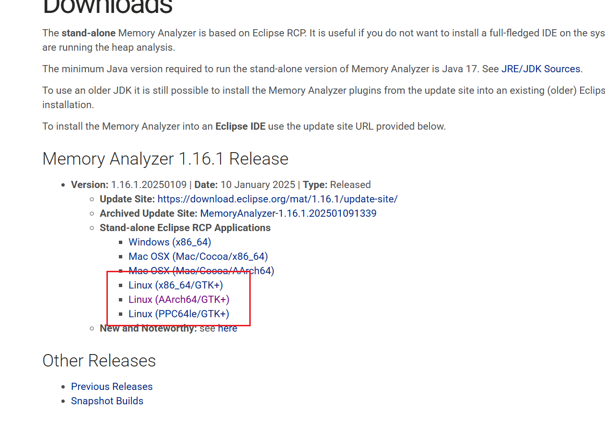
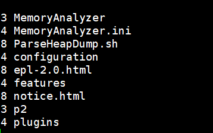
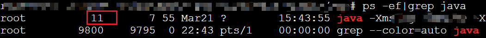
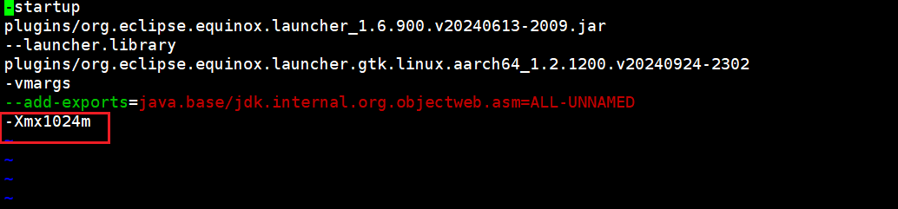
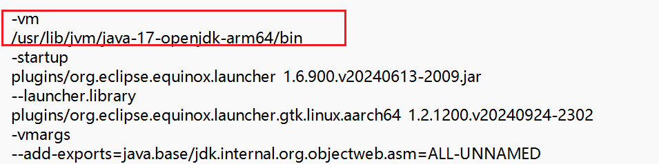
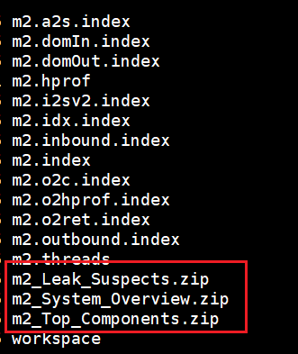

# Linux版本的MAT内存分析工具使用 

## 一、环境准备

- 下载对应平台的工具

   

- 下载完成后解压 得到以下内容

   


## 二、hprof生成

dump可以是内存溢出时让其自动生成，或者手工直接导

- 自动生成，配置jvm参数

  ```
  -XX:+HeapDumpOnOutOfMemoryError -XX:HeapDumpPath=/home/biapp/m.hprof
  ```

- 手动生成，PID为java进程号

  ```
  jmap -dump:live,format=b,file=m.hprof PID
  ```

  其中 pid 可以通过执行 ps -ef|grep java 看到
  
   

## 三、工具使用 

1. 修改初始化的启动的内存大小 

   ```shell
   vim MemoryAnalyzer.ini
   
   -startup
   plugins/org.eclipse.equinox.launcher_1.6.900.v20240613-2009.jar
   --launcher.library
   plugins/org.eclipse.equinox.launcher.gtk.linux.aarch64_1.2.1200.v20240924-2302
   -vmargs
   --add-exports=java.base/jdk.internal.org.objectweb.asm=ALL-UNNAMED
   -Xmx1024m
   ```

   主要修改`-Xmx`这个值 这个要尽量大点 不然我们的内存分析文件很大 会执行不了 ，如下：

    

2. 多jdk版本配置

   1.16.1版本需要jdk17及以上，如果环境有多个jdk版本 可以通过添加配置指定

   ```ini
   -vm
   /usr/lib/jvm/java-17-openjdk-arm64/bin
   ```

   注意：需要在最上面增加 jdk17的bin目录位置，如下图所示

    

   

3. 命令使用

   创建一个单独的目录执行这个，因为执行产生的文件会直接生成在当前目录下

   ```bash
   ./ParseHeapDump.sh m.hprof org.eclipse.mat.api:suspects org.eclipse.mat.api:overview org.eclipse.mat.api:top_components
   ```

   说明：

   - ./ParseHeapDump.sh m.hprof

     ./ParseHeapDump.sh 是要执行的脚本文件，m.hprof 是你传递给脚本的堆转储文件（heap dump）路径。m.hprof 是一个 .hprof 文件，通常包含 Java 应用程序的内存快照

   - org.eclipse.mat.api:suspects

     这个参数指示脚本执行与 "suspects" 相关的分析。suspects 通常是指堆转储中可能存在内存泄漏的地方，脚本会检查哪些对象在堆中占用了大量内存并且可能是泄漏的源头。通常，这些是无法被垃圾回收的对象，它们持有大量  引用，导致内存无法释放。

   - org.eclipse.mat.api:overview

     overview 是一个分析任务，通常用于生成堆转储的总体概览。这可能包括堆内存的使用情况、对象数量、内存占用最多的类、最大的对象等信息。通过该命令，你可以获得堆内存的概览，帮助你了解内存分配的总体情况。

   - org.eclipse.mat.api:top_components

     这个参数会请求脚本显示堆转储中内存占用最多的组件或对象。通常，"top components" 是指占用最多内存的类或对象。通过这个分析，你可以识别出内存使用不当或可能引发性能问题的组件。

​	执行成功后 会在当前目录出现以下文件

​	 

​	主要是这几个压缩包，其他都是过程文件， 解压之后 查看这几个文件内容