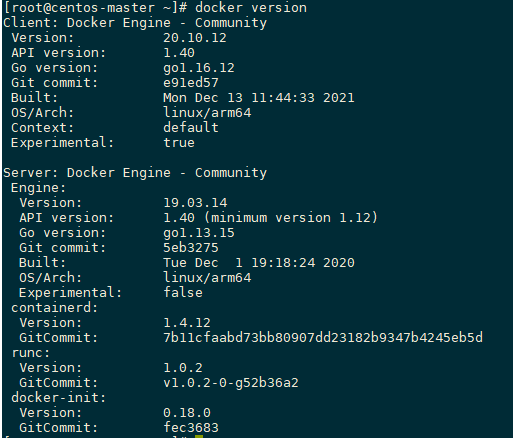

## Centos 7部署docker

### 一、准备工作

1. yum包更新到最新

   ```shell
   sudo yum update
   ```

2. 安装需要的软件包，yum-util 提供yum-config-manager功能，另外两个是devicemapper驱动依赖的

   ```shell
   sudo yum install -y yum-utils device-mapper-persistent-data lvm2
   ```

3. 设置yum源为阿里云

   ```shell
   sudo yum-config-manager --add-rep http://mirrors.aliyun.com/docker-ce/linux/centos/docker-ce.repo（阿里仓库）
   sudo yum-config-manager --add-repo http://download.docker.com/linux/centos/docker-ce.repo（中央仓库）
   ```

4. 禁用SELinux

   > Linux系统默认开启的SELinux安全机制会阻止容器网络部分端口的启用，导致无法正常部署 虚拟化 场景业务。这是Linux OS本身的行为

   **临时方法**

   ```shell
   setenforce 0
   ```

   **永久方法**

   修改文件 `/etc/selinux/config`，将**SELINUX=enforcing**改为**SELINUX=permissive**或者**disabled**

   ```shell
   vim /etc/selinux/config
   #SELINUX=enforcing
   SELINUX=permissive #permissive也可以改为disabled
   ```

   **查看SELinux状态**

   ```shell
   [root@VM-0-2-centos Docsify-Guide]# getenforce 
   Disabled
   ```

5. 禁用防火墙

   ```shell
   systemctl stop firewalld 
   systemctl disable firewalld
   ```

### 二、Docker 部署

#### 离线部署

1. 安装包获取

   - 在线获取

     ```shell
     wget https://download.docker.com/linux/static/stable/aarch64/docker-19.03.10.tgz
     ```

   - 离线获取

     下载地址：https://download.docker.com/linux/static/stable/aarch64/docker-19.03.10.tgz

2. 解压Docker安装包

   ```shell
   tar -zxvf docker-19.03.10.tgz
   ```

3. 将解压后目录中的文件移动到`/usr/bin`下

   ```shell
   cp docker/* /usr/bin
   ```

4. 配置`docker.service`文件

   - 编辑docker.service文件

     ```shell
     vim /usr/lib/systemd/system/docker.service
     ```

   - 添加以下内容

     ```shell
     [Unit]
     Description=Docker Application Container Engine
     Documentation=https://docs.docker.com
     After=network-online.target firewalld.service
     Wants=network-online.target
     [Service]
     Type=notify
     ExecStart=/usr/bin/dockerd
     ExecReload=/bin/kill -s HUP $MAINPID
     LimitNOFILE=infinity
     LimitNPROC=infinity
     TimeoutStartSec=0
     Delegate=yes
     KillMode=process
     Restart=on-failure
     StartLimitBurst=3
     StartLimitInterval=60s
     [Install]
     WantedBy=multi-user.target
     ```

   - 按“**Esc**”键，输入:“**wq!**”，按“**Enter**”保存并退出编辑

5. 启动Docker服务进程

   ```shell
   systemctl start docker
   ```

6. 查看安装情况

   ```
   docker version
   ```

   如下图所示，有Client和Server两部分表示安装成功

     

#### yum部署

1. 查看可用版本

   ```shell
   sudo yum list docker-ce --showduplicates | sort -r
   ```

2. 安装docker

   ```shell
   #只安装docker engine
   sudo yum install docker-ce
   #安装docker engine，docker cli，docker compose
   sudo yum install docker-ce docker-ce-cli containerd.io docker-compose-plugin
   #安装docker指定版本，即包名称 ( docker-ce) 加上版本字符串（第 2 列），从第一个冒号 ( :) 开始，一直到第一个连字符，用连字符 ( -) 分隔。例如，docker-ce-18.09.1。
   sudo yum install docker-ce-<VERSION_STRING> docker-ce-cli-<VERSION_STRING> containerd.io docker-compose-plugin
   #如果没有安装成功docker compose则通过以下命令来安装
   sudo yum -y install docker-compose
   
   #设置开机启动
   systemctl start docker
   systemctl enable docker
   ```

3. 查看docker版本
   ```shell
   docker version
   ```

   如下图所示，有Client和Server两部分表示安装成功

     

4. 卸载docker引擎

   ```shell
   sudo yum remove docker-ce docker-ce-cli containerd.io docker-compose-plugin
   sudo yum remove docker \
                     docker-client \
                     docker-client-latest \
                     docker-common \
                     docker-latest \
                     docker-latest-logrotate \
                     docker-logrotate \
                     docker-engine
   sudo rm -rf /var/lib/docker
   sudo rm -rf /var/lib/containerd
   ```

#### 加速镜像设置

1. 编辑`/etc/docker/daemon.json`文件

   ```shell
   vi /etc/docker/daemon.json
   ```

   如果是刚安装成功是没有这个文件的，需要先创建`/etc/docker`目录

   ```shell
   sudo mkdir -p /etc/docker
   sudo touch /etc/docker/daemon.json
   -- 如果docker启动不起来则将daemon.json的名称改为daemon.conf
   ```

2. 添加如下内容

   ```json
   {
   	"registry.mirrors":["https://docker.mirrors.ustc.edu.cn"]
   }
   ```

### 三、Docker使用

#### docker启动与停止

- 启动docker

  ```shell
  systemctl start docker
  ```

- 停止docker

  ```shell
  systemctl stop docker
  ```

- 重启docker

  ```shell
  systemctl restart docker
  ```

- 开机自启动

  ```shell
  systemctl enable docker
  ```

- 查看docker状态

  ```shell
  systemctl status docker
  ```

- 查看docker概要信息

  ```shell
  docker info
  ```

- 查看docker帮助文档

  ```shell
  docker --help
  ```

#### docker常用命令

1. 镜像相关命令

   - 查看镜像

     ```shell
     docker images
     docker image ls
     ```
     REPOSITORY，镜像名称 
     TAG，镜像标签 
     IMAGE ID，镜像ID
     CREATED，镜像创建时间（不是获取该镜像的日期）
     SIZE，镜像大小
     这些镜像都是存储在docker宿主机的/var/lib/docker目录下

   - 搜索镜像

     如果你需要从网络中查找需要的镜像，可以通过以下命令搜索

     ```shell
     docker search imageName
     ```
     NAME，仓库名称
     DESCRIPTION，镜像miaos
     STARS，用户评价，反应一个镜像的受欢迎程度
     OFFICIAL，是否官方
     AUTOMATED，自动构建，表示该镜像由docker hub自动构建流程创建的
     
     问题：
     
       在搜索镜像的时候会报错：

     ```
     Error response from daemon: Get https://index.docker.io/v1/search?q=centos&n=25: dial tcp: lookup index.docker.io on 192.168.78.2:53: no such host
     ```

     解决(dig解析域名信息)

     ```shell
     dig @114.114.114.114 index.docker.io
     ```

     如果该命令提示

     ```
     -bash: dig: 未找到命令
     ```

     则执行

     ```shell
     yum -y install bind-utils
     ```

     然后在执行

     ```shell
     dig @114.114.114.114 index.docker.io
     ```

     得到一个IP地址

     ```shell
     index.docker.io.	35	IN	CNAME	elb-io.us-east-1.aws.dckr.io.
     elb-io.us-east-1.aws.dckr.io. 663 IN	CNAME	us-east-1-elbio-rm5bon1qaeo4-623296237.us-east-1.elb.amazonaws.com.
     us-east-1-elbio-rm5bon1qaeo4-623296237.us-east-1.elb.amazonaws.com. 35 IN A 50.16.172.3
     us-east-1-elbio-rm5bon1qaeo4-623296237.us-east-1.elb.amazonaws.com. 35 IN A 54.81.26.184
     us-east-1-elbio-rm5bon1qaeo4-623296237.us-east-1.elb.amazonaws.com. 35 IN A 3.220.75.233
     us-east-1-elbio-rm5bon1qaeo4-623296237.us-east-1.elb.amazonaws.com. 35 IN A 34.193.164.221
     us-east-1-elbio-rm5bon1qaeo4-623296237.us-east-1.elb.amazonaws.com. 35 IN A 52.3.104.67
     us-east-1-elbio-rm5bon1qaeo4-623296237.us-east-1.elb.amazonaws.com. 35 IN A 54.236.224.26
     ```

     然后将任意一个IP地址写入

     ```shell
     vi /etc/hosts
     ```

     内容为

     ```shell
     54.236.224.26 index.docker.io
     ```

     最后搜索镜像成功。
   - 拉取镜像

     拉取镜像就是从中央仓库中下载镜像到本地

     ```shell
     docker pull 镜像名称
     ```

     例如，我要下载centos 7镜像

     ```shell
     docker pull centos:7
     ```
     
     此处冒号后面的为tag
   - 删除镜像
   
     按镜像ID删除
   
     ```shell
     docker rmi 镜像ID
     ```

     例如，我要删除centos 7镜像

     ```shell
     docker rmi centos:7
     ```
   
   - 删除所有镜像
   
     ```shell
     docker rmi `docker images -q`
     docker rmi -f $(docker image ls)
     ```


2. 容器相关命令

   - 查看容器

     查看正在运行的容器

     ```shell
     docker ps
     ```

     查看所有容器

     ```shell
     docker ps -a
     docker ps -a --no-trunc
     ```
     
     查看最后一次运行的容器
   
     ```shell
     docker ps -l
     ```

     查看停止的容器
   
     ```shell
     docker ps -f status=exited
     ```

   - 创建于启动容器
   
     创建容器命令
   
     ```shell
     docker run 镜像名称(或者镜像ID)
     ```

     -i，表示运行容器

     -t，表示容器启动后会进入起命令行，加入这两个参数后，容器创建就能登录进行，即分配一个伪终端

     --name，为创建的容器命令

     -v，表示目录映射关系（前者是宿主机目录，后者是映射到宿主机的容器目录），可以使用多个-v做多个目录或文件映射，注意，最好做目录映射，在宿主机上做修改，然后共享到容器上

     -d，在run后面加上-d参数，则会创建一个守护式容器在后台运行（这样创建容器后不会自动登陆容器，如果只加-i，-t两个参数，创建后就会自动进去容器）

     -p，表示端口映射，前者是宿主机端口，后者是容器内的映射端口，可以使用多个-p做多个端口映射

     --link 容器名称:别名，参数中第一个是**容器名**，第二个是定义的**容器别名**（使用别名访问容器），为了方便使用，一般别名默认容器名。
   
     -e，代表添加环境变量
      （1）交互式方式创建容器
   
      ```shell
      docker run -it --name=容器名称 镜像名称:标签 /bin/bash
      docker run -it --name=mycentos centos:7 /bin/bash
      ```
   
      这时我们通过ps命令查看，发现可以看到启动的容器，状态为启动状态
      退出当前容器
   
      ```shell
      exit
      ```
   
      （2）守护式方式创建容器
      ```shell
      docker run -di --name=容器名称 镜像名称:标签
      ```
   
      登陆守护式容器方式：
      ```shell
      docker exec -it 容器名称（或者容器ID） /bin/bash
      ```
   
   - 停止与启动容器
   
     停止容器
   
     ```shell
     docker stop 容器名称（或者容器ID）
     ```
   
     启动容器
   
     ```shell
     docker start 容器名称（或者容器ID）
     ```
   
   - 文件拷贝
   
     如果我们需要将文件拷贝到容器内可以使用cp命令
   
     ```shell
     docker cp 需要拷贝的文件或目录 容器名称：容器目录
     docker cp anaconda-ks.cfg mycentos2:/usr/local/
     ```
   
     也可以将文件从容器内拷贝出来
   
     ```shell
     docker cp 容器名称：容器目录 需要拷贝的文件或目录
     docker cp mycentos2:/usr/local/anaconda-ks.cfg anaconda-ks2.cfg
     ```
   
   - 目录挂载
   
     我们可以在创建容器的时候，将宿主机的目录与容器内的目录进行映射，这样我们就可以通过修改宿主机某个目录的文件从而去影响容器。
   
     创建容器添加-v参数后边为宿主机：容器目录，例如
   
     ```shell
     docker run -di -v /usr/local/myhtml:/usr/local/myhtml --name=mycentos3 centos:7
     ```
   
     默认挂载的路径权限为读写。如果指定为只读可以用：ro，如：/usr/local/myhtml:/usr/local/myhtml:ro
   
     如果你共享的是多级的目录，可能会出现权限不足的提示。
   
     这是因为centos7中的安全模块selinux把权限禁掉了，我们需要添加参数 --privileged=true来解决挂载的目录没有权限的问题
   
     查看容器IP地址
   
     我们可以通过以下命令查看容器运行的各种数据
   
     ```shell
        docker inspect 容器名称（或者容器ID）
     ```
   
     也可以直接执行下面的命令直接输出IP地址
   
     ```shell
        docker inspect --format='{{.NetworkSettings.IPAddress}}' 容器名称（容器ID）
        docker inspect --format='{{.NetworkSettings.IPAddress}}' mycentos3
     ```
   
   - 删除容器
     删除指定的容器
   
     ```shell
        docker rm 容器名称（容器ID）
     ```
   
     运行中的容器不能被删除，要先停止运行中的容器
     
   - 容器互相访问
   
     安装好docker后，运行如下命令创建bridge网络:`docker network create testnet`
   
     查询到新创建的bridge testnet :`docker network ls`
   
     运行容器连接到testnet网络:docker run -it --name <容器名> ---network <bridge> --network-alias <网络别名> <镜像名>，如：
   
     ```shell
     docker run -it --name centos-1 --network testnet --network-alias centos-1 docker.io/centos:latest
     docker run -it --name centos-2 --network testnet --network-alias centos-2 docker.io/centos:latest
     ```
   
     从一个容器ping另外一个容器，测试结果如下：
   
     ```shell
     [root@fafe2622f2af /]# ping centos-1
     PING centos-1 (172.20.0.2) 56(84) bytes of data.
     64 bytes from centos-1.testnet (172.20.0.2): icmp_seq=1 ttl=64 time=0.158 ms
     ```
   
     若访问容器中服务，可以使用这用方式访问 <网络别名>：<服务端口号> 
   
     推荐使用这种方法，自定义网络，因为使用的是网络别名，可以不用顾虑ip是否变动，只要连接到docker内部bright网络即可互访。bridge也可以建立多个，隔离在不同的网段。


### 三、Dockerfile

> Dockerfile是由一系列命令和参数构成的脚本，这些命令应用于基础镜像并最终创建一个新的镜像。


| 命令                                                         | 作用                                                         |
| ------------------------------------------------------------ | ------------------------------------------------------------ |
| FROM image_name:tag (eg. centos:7)                           | 定义了使用哪个基础镜像启动构建流程                           |
| MAINTAINER user_name (eg. itcast)                            | 声明镜像的创建者                                             |
| WORKDIR path_dir(eg. /usr)                                   | 设置工作目录                                                 |
| RUN command(eg. mkdir /usr/local/java)                       | 在构建镜像时执行的命令，是Dockerfile的核心部分（可以写多条） |
| ADD source_dir/file dest_dir/file(eg. jdk-8u251-linux-x64.tar.gz /usr/local/java/) | 将宿主机的文件复制到容器内，如果是一个压缩文件，将会在复制后自动解压 |
| COPY source_dir/file dest_dir/file                           | 和ADD相似，但是如果有压缩文件并不能解压                      |
| ENV key value(eg. JAVA_HOME /usr/local/java/jdk1.8.0_251)    | 设置环境变量（可以写多条）                                   |
| LABEL key="value" (eg. name="itcrazy2016")                   | 设置标签                                                     |
| VOLUME load_dir (eg. /var/lib/mysql)                         | 指定数据的挂在目录，当我们生成镜像的Dockerfile中以Volume声明了匿名卷，并且我们以这个镜像run了一个容器的时候，docker会在安装目录下的指定目录下面生成一个目录来绑定容器的匿名卷，**就是说当Dockerfile中声明了匿名卷,但是run的时候没有使用`-v`绑定匿名卷的话,那么docker就会在安装docker的机器/var/lib/docker/volumes这个目录下创建一个目录来绑定匿名卷** |
| CMD command(eg. ["mysql"])                                   | 容器启动的时候默认会执行的命令，若有多个CMD命令，则最后一个生效<br />**格式1：`CMD <command>` (shell格式)<br/>格式2：`CMD ["executable", "param1", "param2"]` (exec格式，推荐使用)<br/>格式3：`CMD ["param1", "param2"]` (为ENTRYPOINT指令提供参数)** |
| ENTRYPOINT command(eg. ["docker-entrypoint.sh"])             | 和CMD的使用类似，和CMD的不同的是docker run执行时，CMD会覆盖之前的命令，而ENTRYPOINT不会<br />**格式1：`ENTRYPOINT <command>` (shell格式)<br/>格式2：`ENTRYPOINT ["executable", "param1", "param2"]` (exec格式，推荐格式)** |
| EXPOSE port(eg. 3306)                                        | 指定镜像要暴露的端口，启动镜像时，可以使用-p将该端口映射给宿主机 |

#### 用法

命令：`docker build`

```shell
#在Dockerfile当前目录执行以下命令，默认使用当前目录的Dockerfile文件来构建镜像
docker build -t image_name:tag .

#也可以指定Dockerfile文件路径
docker build -t image_name:tag -f /PATH/TO/Dockerfile
```

#### 踩坑记录

- Dockerfile中RUN pwd无效时，在 `docker build` 命令前面增加 `DOCKER_BUILDKIT=0`


### 四、Docker实战

#### mysql的部署

1. 拉取mysql镜像

   ```shell
   docker pull centos/mysql-57-centos7
   ```

2. 创建容器

   ```shell
   docker run -di --name=tensquare_mysql -p 3306:3306 -e MYSQL_ROOT_PASSWORD=123456 mysql
   
   --例如
   docker run -di --name=tensquare_mysql -p 3306:3306 -e MYSQL_ROOT_PASSWORD=123456 centos/mysql-57-centos7
   docker run -di --name mysql -p 3306:3306 -v /data/mysql/conf:/etc/mysql/conf.d -v /data/mysql/data:/var/lib/mysql -e MYSQL_ROOT_PASSWORD='1qaz!QAZ' mysql:latest --character-set-server=utf8mb4 --collation-server=utf8mb4_unicode_ci
   ```

   -p，代表端口映射，格式为宿主机映射端口：容器运行端口

   -e，代表添加环境变量 MYSQL_ROOT_PASSWORD是root用户的登陆密码

3. 进入mysql容器

   ```shell
   docker exec -it tensquare_mysql /bin/bash
   ```

4. 登陆mysql

   ```shell
   mysql -u root -p 
   ```

5. 远程登陆mysql

   ```shell
    mysql -uroot -p
   ```

   在输入密码的界面直接回车就可以了


#### tomcat的部署

1. 拉取tomcat镜像

   ```shell
   docker pull tomcat:7-jre7
   ```

   tomcat:7代表tomcat的版本，jre7表示jre的版本

2. 创建容器

   ```shell
   docker run -di --name=mytomcat -p 9000:8080 -v /usr/local/webapps:/usr/local/tomcat/webapps tomcat:7-jre7
   ```


#### nginx的部署

1. 拉取nginx镜像

   ```shell
   docker pull nginx
   ```

   tomcat:7代表tomcat的版本，jre7表示jre的版本

2. 创建容器

   ```shell
   docker run -di --name=mynginx -p 80:80 v /data/nginx/nginx.conf:/etc/nginx/nginx.conf:ro -v /data/nginx:/usr/share:ro nginx
   ```


#### redis的部署

1. 拉取redis镜像

   ```shell
   docker pull redis
   ```

2. 创建容器

   ```shell
   docker run -d --name redis -p 6379:6379 -v /data/redis/data:/data -v /data/redis/conf:/usr/local/etc/redis redis:6.0 redis-server /usr/local/etc/redis/redis.conf --appendonly yes  --requirepass '1qaz!QAZ' --save 60 1 --loglevel warning
   ```
   
   `redis.conf`要将`bind`改成 `0.0.0.0`，不然访问不了

#### consul的部署

```shell
docker pull consul
docker run -di --name=consul -p 8500:8500 --restart=always consul:latest agent -server -bootstrap -ui -node=consul1 -client='0.0.0.0'
```

https://learn.hashicorp.com/tutorials/consul/docker-container-agents?in=consul/docker

#### kafka的部署

```yaml
version: "2"

services:
  zookeeper:
    container_name: zookeeper
    image: docker.io/bitnami/zookeeper:3.8
    network_mode: bridge
    ports:
      - "2181:2181"
    user: root
    volumes:
      - "/data/bitnami/zookeeper:/bitnami/zookeeper"
    environment:
      - ALLOW_ANONYMOUS_LOGIN=yes
  kafka:
    container_name: kafka
    image: docker.io/bitnami/kafka:3.2
    network_mode: bridge
    ports:
      - "9092:9092"
    user: root
    volumes:
      - "/data/bitnami/kafka:/bitnami/kafka"
    environment:
      - KAFKA_CFG_LISTENERS=PLAINTEXT://:9092
      - KAFKA_CFG_ADVERTISED_LISTENERS=PLAINTEXT://127.0.0.1:9092
      - KAFKA_CFG_ZOOKEEPER_CONNECT=zookeeper:2181
      - ALLOW_PLAINTEXT_LISTENER=yes
    depends_on:
      - zookeeper
    links:
      - zookeeper


```

```shell
#默认执行当前目录下的docker-compose.yaml
docker-compose up -d .
#执行指定目录下的*.yaml
docker-compose -f filename.yml up -d
```


#### openresty的部署

```shell
./configure --prefix=/usr/local/openresty --with-luajit --without-http_redis2_module --with-http_iconv_module --with-http_sub_module --with-openssl=../openssl-3.0.4
```

#### openssl的部署

```
wget -nc --no-check-certificate https://www.openssl.org/source/openssl-3.0.2.tar.gz -P /usr/local/src
tar -zxvf  /usr/local/src/openssl-3.0.2.tar.gz  -C /usr/local/src
cd /usr/local/src/openssl-3.0.2 || exit

yum install perl-ExtUtils-CBuilder perl-ExtUtils-MakeMaker
./config --prefix=/usr/local/ssl/
make -j 4
make install
mv /usr/bin/openssl /usr/bin/openssl.old
mv /usr/include/openssl/ /usr/include/openssl.old
ln -s /usr/local/ssl/bin/openssl /usr/bin/openssl
ln -s /usr/local/ssl/include/openssl /usr/include/openssl
echo "/usr/local/ssl/lib64/" >> /etc/ld.so.conf
ldconfig
openssl version
```


#### MinIo的部署

```shell
docker run -di --name=minio -p 9000:9000 -p 9999:9999 -v /data/minio:/data -v /etc/minio/config:/root/.minio -e MINIO_ROOT_USER=admin -e MINIO_ROOT_PASSWORD=Admin123456 minio/minio server /data --console-address ":9999"
```

#### skywalking部署

`instances.yml`

```yaml
instances:
  - name: es01
    dns:
      - es01 
      - localhost
    ip:
      - 127.0.0.1
```

`create-certs.yml`

```yaml
version: '3.8'

services:
  create_certs:
    container_name: create_certs
    image: docker.elastic.co/elasticsearch/elasticsearch:7.5.2
    command: >
      bash -c '
        yum install -y -q -e 0 unzip;
        if [[ ! -f /certs/bundle.zip ]]; then
          bin/elasticsearch-certutil cert --silent --pem --in config/certificates/instances.yml -out /certs/bundle.zip;
          unzip /certs/bundle.zip -d /certs; 
        fi;
        if [[ ! -f /certs/certificate.zip ]]; then
          bin/elasticsearch-certutil cert --silent -ca-cert /certs/ca/ca.crt -ca-key /certs/es01/es01.key --pass '1qaz!QAZ' --in config/certificates/instances.yml --days 3650 -out /certs/certificate.zip;
          unzip /certs/certificate.zip -d /certs; 
          rm -rf /certs/certificate.zip;
        fi;
        chown -R 1000:0 /certs
      '
    user: "0"
    working_dir: /usr/share/elasticsearch
    volumes: ['certs:/certs', '.:/usr/share/elasticsearch/config/certificates']

volumes: {"certs"}


```

`.env`

```properties
COMPOSE_PROJECT_NAME=es 
CERTS_DIR=/usr/share/elasticsearch/config/certificates 
ELASTIC_PASSWORD=1qaz!QAZ
```

`docker-compose.yaml`

```yaml
version: '3.8'
services:
  elasticsearch:
    image: docker.elastic.co/elasticsearch/elasticsearch:7.5.2
    container_name: es01
    ports:
      - "9200:9200"
    healthcheck:
      test: curl --cacert $CERTS_DIR/ca/ca.crt -s https://127.0.0.1:9200 >/dev/null; if [[ $$? == 52 ]]; then echo 0; else echo 1; fi
      interval: 30s
      timeout: 10s
      retries: 3
      start_period: 10s
    environment:
      - discovery.type=single-node
      - bootstrap.memory_lock=true
      - ELASTIC_PASSWORD=$ELASTIC_PASSWORD 
      - "ES_JAVA_OPTS=-Xms512m -Xmx512m"
      - xpack.license.self_generated.type=trial 
      - xpack.security.enabled=true
      - xpack.security.http.ssl.enabled=true
      - xpack.security.http.ssl.key=$CERTS_DIR/es01/es01.key
      - xpack.security.http.ssl.certificate=$CERTS_DIR/es01/es01.crt
      - xpack.security.http.ssl.certificate_authorities=$CERTS_DIR/ca/ca.crt
      - xpack.security.transport.ssl.enabled=true
      - xpack.security.transport.ssl.verification_mode=certificate
      - xpack.security.transport.ssl.key=$CERTS_DIR/es01/es01.key
      - xpack.security.transport.ssl.certificate=$CERTS_DIR/es01/es01.crt
      - xpack.security.transport.ssl.certificate_authorities=$CERTS_DIR/ca/ca.crt
    ulimits:
      memlock:
        soft: -1
        hard: -1
    volumes:
      - data:/usr/share/elasticsearch/data
      - logs:/usr/share/elasticsearch/logs
      - config:/usr/share/elasticsearch/config
      - certs:$CERTS_DIR
  oap:
    image: apache/skywalking-oap-server:latest
    container_name: skywalking-oap-server
    depends_on:
      elasticsearch:
        condition: service_healthy
    links:
      - elasticsearch
    ports:
      - "11800:11800"
      - "12800:12800"
    healthcheck:
      test: [ "CMD-SHELL", "/skywalking/bin/swctl ch" ]
      interval: 30s
      timeout: 10s
      retries: 3
      start_period: 10s
    environment:
      SW_STORAGE: elasticsearch
      SW_STORAGE_ES_HTTP_PROTOCOL: https
      SW_STORAGE_ES_CLUSTER_NODES: es01:9200
      SW_STORAGE_ES_SSL_JKS_PATH: "/app/skywalking/config/certs/es01/es01.jks"
      SW_STORAGE_ES_SSL_JKS_PASS: "1qaz!QAZ"
      SW_ES_USER: elastic
      SW_ES_PASSWORD: "1qaz!QAZ"
      SW_STORAGE_DAY_STEP: 1
      SW_CORE_RECORD_DATA_TTL: 3
      SW_HEALTH_CHECKER: default
      SW_TELEMETRY: prometheus
      JAVA_OPTS: "-Xms2048m -Xmx2048m"
    volumes:
      - skywalking-config:/app/skywalking/config
  ui:
    image: apache/skywalking-ui:latest
    container_name: skywalking-ui
    depends_on:
      oap:
        condition: service_healthy
    links:
      - oap
    ports:
      - "8080:8080"
    environment:
      SW_OAP_ADDRESS: http://oap:12800
      SW_ZIPKIN_ADDRESS: http://oap:9412

volumes:
  data:
    driver: local
  logs:
    driver: local
  config:
    driver: local
  certs:
    driver: local
  skywalking-config:
    driver: local
```

`otel-collector-config.yaml`

```yaml
receivers:
  prometheus:
    config:
     scrape_configs:
       - job_name: 'mysql-monitoring'
         scrape_interval: 5s
         static_configs:
           - targets: ['mysqld-exporter:9104']
             labels:
               host_name: showcase
processors:
  batch:

exporters:
  otlp:
    endpoint: 9.135.11.65:11800
    tls:
      insecure: true
service:
  pipelines:
    metrics:
      receivers:
      - prometheus
      processors:
      - batch
      exporters:
      - otlp
```

`docker-compose-mysqld-exporter.yaml`

```yaml
version: '3.8'
services:
  mysqld-exporter:
    image: prom/mysqld-exporter:v0.14.0
    container_name: mysqld-exporter
    ports:
      - 9104:9104
    environment:
      - DATA_SOURCE_NAME=mysql_exporter:mysql_exporter@(9.135.11.65:3306)/
      - TZ=Asia/Shanghai
  otel-collector:
    image: otel/opentelemetry-collector:0.50.0
    container_name: otel-collector
    command: [ "--config=/etc/otel/otel-collector-config.yaml" ]
    volumes:
      - /data/skywalking/otel-collector-config.yaml:/etc/otel/otel-collector-config.yaml
    expose:
      - 55678
```

最后依次执行一下命令：

```shell
docker-compose -f create-certs.yml run --rm create_certs
docker-compose up -d
bin/elasticsearch-users useradd admin -p '1qaz!QAZ' -r superuser
bin/elasticsearch-users list
mkdir -p /data/docker/lib/volumes/es_skywalking-config/_data/certs/es01
cd /data/docker/lib/volumes/es_skywalking-config/_data/certs
cp -r /data/docker/lib/volumes/es_certs/_data/* .
cd es01
/usr/local/java/TencentKona-8.0.11-345/jre/bin/keytool -importkeystore -srckeystore es01.p12 -srcstoretype pkcs12 -destkeystore es01.jks -deststoretype JKS
/usr/local/java/TencentKona-8.0.11-345/jre/bin/keytool -importkeystore -srckeystore es01.jks -destkeystore es01.jks -deststoretype pkcs12
docker-compose up -d
docker run --rm -v es_certs:/certs --network=es_default docker.elastic.co/elasticsearch/elasticsearch:7.5.2 curl --cacert /certs/ca/ca.crt -u elastic:1qaz!QAZ https://es01:9200
docker-compose -f docker-compose-mysqld-exporter.yaml up -d
docker compose --file '/data/skywalking/docker-compose-mysqld-exporter.yaml' --project-name 'es' down

#如果es的证书到期之后可以申请延期证书
#第一步：下载一个license.json
https://license.elastic.co/registration
#第二步：查看当前证书有效期
curl --cacert /usr/share/elasticsearch/config/certificates/ca/ca.crt -u admin:'1qaz!QAZ' 'https://es01:9200/_license'
{
  "license" : {
    "status" : "expired",
    "uid" : "bb51fff8-54cc-4908-8df2-e3afb5f813d6",
    "type" : "trial",
    "issue_date" : "2023-05-10T02:23:08.028Z",
    "issue_date_in_millis" : 1683685388028,
    "expiry_date" : "2023-06-09T02:23:08.028Z",
    "expiry_date_in_millis" : 1686277388028,
    "max_nodes" : 1000,
    "issued_to" : "docker-cluster",
    "issuer" : "elasticsearch",
    "start_date_in_millis" : -1
  }
}
#第三步：上传证书到服务器
#第四步：更新es的证书
curl -X POST --cacert /usr/share/elasticsearch/config/certificates/ca/ca.crt -u admin:'1qaz!QAZ' 'https://es01:9200/_license/start_basic?acknowledge=true' -H "Content-Type: application/json" -d @license.json
#第五步：验证更新后的证书是否生效
{
  "license" : {
    "status" : "active",
    "uid" : "5e812d8b-62fa-4cf5-8bd1-6998b3a455bf",
    "type" : "basic",
    "issue_date" : "2023-06-19T07:40:07.336Z",
    "issue_date_in_millis" : 1687160407336,
    "max_nodes" : 1000,
    "issued_to" : "docker-cluster",
    "issuer" : "elasticsearch",
    "start_date_in_millis" : -1
  }
}
```


#### Pulsar部署

```yaml
version: '3.5'

services:
  pulsar:
    image: "apachepulsar/pulsar:2.10.1"
    container_name: pulsar-server
    command: bin/pulsar standalone
    environment:
      PULSAR_MEM: "-Xms512m -Xmx512m -XX:MaxDirectMemorySize=1g"
    volumes:
      - pulsardata:/pulsar/data
      - pulsarconf:/pulsar/conf
      - pulsarlogs:/pulsar/logs
    ports:
      - "16650:6650"
      - "18080:8080"
    restart: unless-stopped
    networks:
      - pulsar_network
      
  pulsar-manager:
    image: "apachepulsar/pulsar-manager:v0.10.0"
    ports:
      - "9527:9527"
      - "7750:7750"
    depends_on:
      - pulsar
    environment:
      SPRING_CONFIGURATION_FILE: /pulsar-manager/pulsar-manager/application.properties
    volumes:
      - pulsarmanger:/pulsar-manager/pulsar-manager
    networks:
      - pulsar_network   

volumes:
  pulsardata:
    driver: local
  pulsarconf:
    driver: local
  pulsarlogs:
    driver: local
  pulsarmanger:
    driver: local
networks:
  pulsar_network:
    name: pulsar_network
    driver: bridge    
```

#### Postgresql部署

```yaml
version: '2'

services:
  postgresql:
    image: docker.io/bitnami/postgresql:14
    ports:
      - '5432:5432'
    volumes:
      - 'postgresql_data:/bitnami/postgresql'
    environment:
      - POSTGRESQL_USERNAME=root
      - "POSTGRESQL_PASSWORD=1qaz!QAZ"
      - "POSTGRESQL_POSTGRES_PASSWORD=1qaz!QAZ"
      - POSTGRESQL_DATABASE=actuator

volumes:
  postgresql_data:
    driver: local
```

#### mariaDB部署

```shell
docker run -di --name mariadb -p 23306:3306 -v /my/own/datadir:/var/lib/mysql -v /my/custom:/etc/mysql/conf.d -e MARIADB_ROOT_PASSWORD='1qaz!QAZ' mariadb:10.10
```
