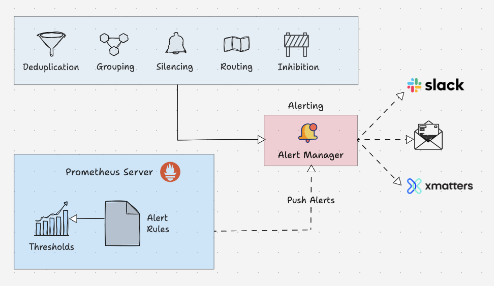

## 介绍

> Prometheus 是由 SoundCloud开源的系统监控报警工具和时间序列数据库(TSDB)。基于Go语言开发，专为云原生环境和大规模分布式系统设计。
>
> Prometheus的基本原理是通过HTTP协议周期性抓取被监控组件的状态，任意组件只要提供对应的HTTP接口就可以接入监控，不需要任何SDK或者其他的集成过程。这样做非常适合做虚拟化环境监控系统，比如VM、Docker、Kubernetes等。输出被监控组件信息的HTTP接口被叫做exporter 。目前互联网公司常用的组件大部分都有exporter可以直接使用，比如Varnish、Haproxy、Nginx、MySQL、Linux系统信息(包括磁盘、内存、CPU、网络等等)。

**其核心特点包括：**

- **高效的数据抓取机制**：Prometheus 通过拉取（pull）模式定期从目标应用收集指标数据。支持PushGateway采集瞬时任务的数据
- **支持多维数据模型**：由度量名和键值对组成的时间序列数据
- **时序数据库**：内置时间序列数据库TSDB，用于存储来自不同来源的时序数据（如 CPU、内存使用率等），支持高效查询和聚合
- **灵活的查询语言 PromQL（Prometheus Query Language）**：提供强大的查询功能，支持复杂的数据聚合、计算和分析
- **集成告警系统**：可以基于设定的规则触发报警，并通过多种渠道（如邮件、Slack、钉钉等）通知相关人员
- **可扩展性和丰富的生态**：多种可视化和仪表盘，支持第三方Dashboard，比如Grafana集成，进行高效的可视化分析
- **监控目标发现**：支持服务发现和静态配置两种方式发现目标

**Prometheus的存在的局限性:**

- **更多地展示的是趋势性的监控**：Prometheus作为一个基于度量的系统，不适合存储事件或者日志等，它更多地展示的是趋势性的监控。如果用户需要数据的精准性（不足），可以考虑ELK或其他日志架构。另外，APM更适用于链路追踪的场景。

- **Prometheus本地不适合存储大量历史数据存储**：Prometheus认为只有最近的监控数据才有查询的需要，所有Prometheus本地存储的设计初衷只是保存短期（如一个月）的数据，不会针对大量的历史数据进行存储。如果需要历史数据，则建议：使用Prometheus的远端存储，如：OpenTSDB、M3DB等。

- **成熟度没有 InfluxDB高**：Prometheus在集群上不论是采用联邦集群还是采用Improbable开源的Thanos等方案，都没有InfluxDB成熟度高，需要解决很多细节上的技术问题（如耗尽CPU、消耗机器资源等问题），部分互联网公司拥有海量业务，出于集群的原因会考虑对单机免费但是集群收费的InfluxDB进行自主研发。

## 工作原理

### 系统架构概述

 

### 组件概述

#### Prometheus Server

Prometheus 服务器是基于指标的监控系统的大脑。服务器的主要工作是使用拉模型从各个目标收集指标。目标只不过是服务器、pod、端点等，使用 Prometheus 从目标收集指标的通用术语称为抓取。Prometheus服务端以一个进程方式启动，如果不考虑参数和后台运行的话，只需要解压安装包之后运行 `./prometheus`脚本即可启动，程序默认监听在9090端口。每次采集到的数据叫做metrics。这些采集到的数据会先存放在内存中，然后定期再写入硬盘，如果服务重新启动的话会将硬盘数据写回到内存中，所以对内存有一定消耗。Prometheus不需要重视历史数据，所以默认只会保留15天的数据。 Prometheus Server配置示例：

```yaml
global:
  scrape_interval: 15s 
  evaluation_interval: 15s 
  scrape_timeout: 10s 

rule_files:
  - "rules/*.rules"

scrape_configs:
  - job_name: 'prometheus'
    static_configs:
      - targets: ['localhost:9090'] 
  - job_name: 'node-exporter'
    static_configs:
      - targets: ['node-exporter:9100'] 

alerting:
  alertmanagers:
    - static_configs:
        - targets: ['alertmanager:9093']
```

#### Service Discovery

> Prometheus 使用两种方法从目标中获取指标

- 静态配置：当目标具有静态 IP 或 DNS 端点时，我们可以使用这些端点作为目标。
- 服务发现：在大多数自动伸缩系统和 Kubernetes 等分布式系统中，目标不会有静态端点。在这种情况下，使用 prometheus 服务发现来发现目标端点，并且目标会自动添加到 prometheus 配置中。

#### Time-Series Database (TSDB)

> Prometheus 接收到的指标数据随着时间的推移而变化（CPU、内存、网络 IO 等）。它被称为时间序列数据。因此 Prometheus 使用时间序列数据库（TSDB）来存储其所有数据。默认情况下，Prometheus 以高效的格式（块）将其所有数据存储在本地磁盘中。随着时间的推移，它会压缩所有旧数据以节省空间。它还具有删除旧数据的保留策略。TSDB 具有内置的机制来管理长期保存的数据。您可以选择以下任意数据保留策略。

- 基于时间的保留：数据将保留指定的天数。默认保留期为 15 天。
- 基于大小的保留：您可以指定 TSDB 可以容纳的最大数据量。一旦达到这个限制，普罗米修斯将释放空间来容纳新数据。

> [!TIP]
> Prometheus 还提供远程存储选项。这主要是存储可扩展性、长期存储、备份和灾难恢复等所需要的。

#### Prometheus Exporters

> Exporter 就像在目标上运行的代理。它将指标从特定系统转换为普罗米修斯可以理解的格式。它可以是系统指标，如 CPU、内存等，也可以是 Java JMX 指标、MySQL 指标等。
>
> 默认情况下，这些转换后的指标由 Exporter 在目标的 /metrics 路径（HTTP 端点）上公开。例如，如果要监控服务器的 CPU 和内存，则需要在该服务器上安装 Node Exporter，并且 Node Exporter 以 prometheus 指标格式在 /metrics 上公开 CPU 和内存指标。一旦 Prometheus 提取指标，它将结合指标名称、标签、值和时间戳生成结构化数据。
>
> 社区有很多 Exporters 可用，但只有其中一些获得 Prometheus 官方认可。如果您需要更多自定义采集，则需要创建自己的导出器。Prometheus 将 Exporter 分为各个部分，例如数据库、硬件、问题跟踪器和持续集成、消息系统、存储、公开 Prometheus 指标的软件、其他第三方实用程序等。您可以从[官方文档](https://prometheus.io/docs/instrumenting/exporters/)中查看每个类别的 Exporter 列表。
>

一般来说可以将Exporter分为2类：

- 直接采集：这一类Exporter直接内置了对Prometheus监控的支持，比如cAdvisor，Kubernetes，Etcd，Gokit等，都直接内置了用于向Prometheus暴露监控数据的端点。
- 间接采集：间接采集，原有监控目标并不直接支持Prometheus，因此我们需要通过Prometheus提供的Client Library编写该监控目标的监控采集程序。例如： Mysql Exporter，JMX Exporter，Consul Exporter等。

#### Prometheus Pushgateway

> Prometheus 默认使用 pull 方式来抓取指标。然而，有些场景需要将指标推送到 prometheus。让我们举一个在 Kubernetes cronjob 上运行的批处理作业的示例，该作业每天根据某些事件运行 5 分钟。在这种情况下，Prometheus 将无法使用拉机制正确抓取服务级别指标。因此，我们需要将指标推送到 prometheus，而不是等待 prometheus 拉取指标。为了推送指标，prometheus 提供了一个名为 Pushgateway 的解决方案。它是一种中间网关。
>
> Pushgateway 需要作为独立组件运行。批处理作业可以使用 HTTP API 将指标推送到 Pushgateway。然后 Pushgateway 在 /metrics 端点上公开这些指标。然后 Prometheus 从 Pushgateway 中抓取这些指标。
>
> Pushgateway 将指标数据临时存储在内存中。它更像是一个临时缓存。Pushgateway 配置也将在 Prometheus 配置中的 scrape_configs 部分下进行配置。

```yaml
scrape_configs:
  - job_name: "pushgateway"
    honor_labels: true
    static_configs:
    - targets: [pushgateway.monitoring.svc:9091]
```

**要将指标发送到 Pushgateway，您需要使用 prometheus 客户端库对应用程序插桩，或使用脚本暴露指标。**

#### Prometheus Alert Manager

> Alertmanager 是 Prometheus 监控系统的关键部分。它的主要工作是根据 Prometheus 警报配置中设置的指标阈值发送警报。警报由 Prometheus 触发（注意，是由 Prometheus 进程触发原始告警）并发送到 Alertmanager。Alertmanager 对告警去重、抑制、静默、分组，最后使用各类通知媒介（电子邮件、slack 等）发出告警事件。其具体功能：

- Alert Deduplicating：消除重复警报
- Grouping：将相关警报分组在一起
- Silencing：静默维护
- Routing：路由，根据严重性将警报路由到适当的接收者
- Inhibition：抑制，当存在中高严重性警报时停止低严重性警报的过程

 

> 以下是警报规则的配置示例

```yaml
groups:
- name: microservices_alerts
  rules:
  - record: http_latency:average_latency_seconds
    expr: sum(http_request_duration_seconds_sum) / sum(http_request_duration_seconds_count)
  - alert: HighLatencyAlert
    expr: http_latency:average_latency_seconds > 0.5
    for: 5m
    labels:
      severity: critical
    annotations:
      summary: "High latency detected in microservices"
      description: "The average HTTP latency is high ({{ $value }} seconds) in the microservices cluster."
```

> 这是 Alertmanager 配置文件的路由配置示例

```yaml
routes:
- match:
    severity: 'critical'
  receiver: 'pagerduty-notifications'

- match:
    severity: 'warning'
  receiver: 'slack-notifications'
```

Alertmanager 支持大多数消息和通知系统，例如 Discord、电子邮件、Slack 等，以将警报作为通知发送给接收者。

#### PromQL

> PromQL 是一种灵活的查询语言，可用于从 prometheus 查询时间序列指标。我们可以直接从 Prometheus 用户界面使用查询，也可以使用 curl 命令通过命令行界面进行查询。另外，当您将 prometheus 作为数据源添加到 Grafana 时，您可以使用 PromQL 来查询和创建 Grafana 仪表板。

##### Prometheus数据模型

> Prometheus中存储的数据为时间序列，即基于同一度量标准或者同一时间维度的数据流，除了时间序列数据的正常存储外，Prometheus还会基于原始数据临时生成新的时间序列数据，用于后续查询的依据或结果。

Prometheus会将所有采集到的样本数据以时间序列（time-series）的方式保存在内存数据库中，并且定时保存到硬盘上。time-series是按照时间戳和值的序列顺序存放的，我们称之为向量(vector)，每条time-series通过指标名称(metrics name)和一组标签集(labelset)命名。如下所示

```html
  ^
  │   . . . . . . . . . . . . . . . . .   . .   node_cpu{cpu="cpu0",mode="idle"}
  │     . . . . . . . . . . . . . . . . . . .   node_cpu{cpu="cpu0",mode="system"}
  │     . . . . . . . . . .   . . . . . . . .   node_load1{}
  │     . . . . . . . . . . . . . . . .   . .  
  v
    <------------------ 时间 ---------------->
```

在time-series中的每一个点称为一个样本（sample），样本由以下三部分组成：

- 指标(metric)：metric name和描述当前样本特征的labelsets;
- 时间戳(timestamp)：一个精确到毫秒的时间戳;
- 样本值(value)： 一个float64的浮点型数据表示当前样本的值。

```ini
<--------------- metric ---------------------><-timestamp -><-value->
http_request_total{status="200", method="GET"}@1434417560938 => 94355
http_request_total{status="200", method="GET"}@1434417561287 => 94334

http_request_total{status="404", method="GET"}@1434417560938 => 38473
http_request_total{status="404", method="GET"}@1434417561287 => 38544

http_request_total{status="200", method="POST"}@1434417560938 => 4748
http_request_total{status="200", method="POST"}@1434417561287 => 4785
```

##### metric(指标)

在形式上，所有的指标(Metric)都通过如下格式标示：

```ini
<metric name>{<label name>=<label value>, ...}
```

指标的名称(metric name)可以反映被监控样本的含义（比如，`http_request_total` - 表示当前系统接收到的HTTP请求总量）。指标名称只能由ASCII字符、数字、下划线以及冒号组成并必须符合正则表达式`[a-zA-Z_:][a-zA-Z0-9_:]*`。

##### label(标签)

标签(label)反映了当前样本的特征维度，通过这些维度Prometheus可以对样本数据进行过滤，聚合等。标签的名称只能由ASCII字符、数字以及下划线组成并满足正则表达式`[a-zA-Z_][a-zA-Z0-9_]*`。

其中以`__`作为前缀的标签，是系统保留的关键字，只能在系统内部使用。标签的值则可以包含任何Unicode编码的字符。在Prometheus的底层实现中指标名称实际上是以`__name__=<metric name>`的形式保存在数据库中的，因此以下两种方式均表示的同一条time-series：

```ini
api_http_requests_total{method="POST", handler="/messages"}
```

等同于：

```ini
{__name__="api_http_requests_total"，method="POST", handler="/messages"}
```

在Prometheus源码中也可以指标(Metric)对应的数据结构，如下所示：

```ini
type Metric LabelSet

type LabelSet map[LabelName]LabelValue

type LabelName string

type LabelValue string
```

##### metric类型

###### Counter：只增不减的计数器

Counter类型的指标其工作方式和计数器一样，只增不减（除非系统发生重置）。常见的监控指标，如`http_requests_total`，`node_cpu`都是Counter类型的监控指标。 一般在定义Counter类型指标的名称时推荐使用`_total`作为后缀。

Counter是一个简单但有强大的工具，例如我们可以在应用程序中记录某些事件发生的次数，通过以时序的形式存储这些数据，我们可以轻松的了解该事件产生速率的变化。 PromQL内置的聚合操作和函数可以让用户对这些数据进行进一步的分析：

例如，通过`rate()`函数获取HTTP请求量的增长率：

```ini
rate(http_requests_total[5m])
```

查询当前系统中，访问量前10的HTTP地址：

```ini
topk(10, http_requests_total)
```

###### Gauge：可增可减的仪表盘

与Counter不同，Gauge类型的指标侧重于反应系统的当前状态。因此这类指标的样本数据可增可减。常见指标如：`node_memory_MemFree`（主机当前空闲的内容大小）、`node_memory_MemAvailable`（可用内存大小）都是Gauge类型的监控指标。

通过Gauge指标，用户可以直接查看系统的当前状态：

```ini
node_memory_MemFree
```

对于Gauge类型的监控指标，通过PromQL内置函数`delta()`可以获取样本在一段时间返回内的变化情况。例如，计算CPU温度在两个小时内的差异：

```ini
delta(cpu_temp_celsius{host="zeus"}[2h])
```

还可以使用`deriv()`计算样本的线性回归模型，甚至是直接使用`predict_linear()`对数据的变化趋势进行预测。例如，预测系统磁盘空间在4个小时之后的剩余情况：

```ini
predict_linear(node_filesystem_free{job="node"}[1h], 4 * 3600)
```

###### 使用Histogram和Summary分析数据分布情况

除了Counter和Gauge类型的监控指标以外，Prometheus还定义了Histogram和Summary的指标类型。Histogram和Summary主用用于统计和分析样本的分布情况。

在大多数情况下人们都倾向于使用某些量化指标的平均值，例如CPU的平均使用率、页面的平均响应时间。这种方式的问题很明显，以系统API调用的平均响应时间为例：如果大多数API请求都维持在100ms的响应时间范围内，而个别请求的响应时间需要5s，那么就会导致某些WEB页面的响应时间落到中位数的情况，而这种现象被称为长尾问题。

为了区分是平均的慢还是长尾的慢，最简单的方式就是按照请求延迟的范围进行分组。例如，统计延迟在0&#126;10ms之间的请求数有多少而10&#126;20ms之间的请求数又有多少。通过这种方式可以快速分析系统慢的原因。Histogram和Summary都是为了能够解决这样问题的存在，通过Histogram和Summary类型的监控指标，我们可以快速了解监控样本的分布情况。

例如，指标`prometheus_tsdb_wal_fsync_duration_seconds`的指标类型为Summary。 它记录了Prometheus Server中wal_fsync处理的处理时间，通过访问Prometheus Server的`/metrics`地址，可以获取到以下监控样本数据：

```ini
# HELP prometheus_tsdb_wal_fsync_duration_seconds Duration of WAL fsync.
# TYPE prometheus_tsdb_wal_fsync_duration_seconds summary
prometheus_tsdb_wal_fsync_duration_seconds{quantile="0.5"} 0.012352463
prometheus_tsdb_wal_fsync_duration_seconds{quantile="0.9"} 0.014458005
prometheus_tsdb_wal_fsync_duration_seconds{quantile="0.99"} 0.017316173
prometheus_tsdb_wal_fsync_duration_seconds_sum 2.888716127000002
prometheus_tsdb_wal_fsync_duration_seconds_count 216
```

从上面的样本中可以得知当前Prometheus Server进行wal_fsync操作的总次数为216次，耗时2.888716127000002s。其中中位数（quantile=0.5）的耗时为0.012352463，9分位数（quantile=0.9）的耗时为0.014458005s。

在Prometheus Server自身返回的样本数据中，我们还能找到类型为Histogram的监控指标`prometheus_tsdb_compaction_chunk_range_bucket`。

```ini
# HELP prometheus_tsdb_compaction_chunk_range Final time range of chunks on their first compaction
# TYPE prometheus_tsdb_compaction_chunk_range histogram
prometheus_tsdb_compaction_chunk_range_bucket{le="100"} 0
prometheus_tsdb_compaction_chunk_range_bucket{le="400"} 0
prometheus_tsdb_compaction_chunk_range_bucket{le="1600"} 0
prometheus_tsdb_compaction_chunk_range_bucket{le="6400"} 0
prometheus_tsdb_compaction_chunk_range_bucket{le="25600"} 0
prometheus_tsdb_compaction_chunk_range_bucket{le="102400"} 0
prometheus_tsdb_compaction_chunk_range_bucket{le="409600"} 0
prometheus_tsdb_compaction_chunk_range_bucket{le="1.6384e+06"} 260
prometheus_tsdb_compaction_chunk_range_bucket{le="6.5536e+06"} 780
prometheus_tsdb_compaction_chunk_range_bucket{le="2.62144e+07"} 780
prometheus_tsdb_compaction_chunk_range_bucket{le="+Inf"} 780
prometheus_tsdb_compaction_chunk_range_sum 1.1540798e+09
prometheus_tsdb_compaction_chunk_range_count 780
```

与Summary类型的指标相似之处在于Histogram类型的样本同样会反应当前指标的记录的总数(以`_count`作为后缀)以及其值的总量（以`_sum`作为后缀）。不同在于Histogram指标直接反应了在不同区间内样本的个数，区间通过标签len进行定义。

同时对于Histogram的指标，我们还可以通过`histogram_quantile()`函数计算出其值的分位数。不同在于Histogram通过`histogram_quantile()`函数是在服务器端计算的分位数。 而Sumamry的分位数则是直接在客户端计算完成。因此对于分位数的计算而言，Summary在通过PromQL进行查询时有更好的性能表现，而Histogram则会消耗更多的资源。反之对于客户端而言Histogram消耗的资源更少。在选择这两种方式时用户应该按照自己的实际场景进行选择。

##### PromQL操作符

##### PromQL聚合操作

##### PromQL内置函数

##### 4个黄金指标和USE方法


## 部署安装

### 准备工作

- 数据盘准备

  创建数据存放目录

  ```bash
  [root@test03 ~]# mkdir -p /data01
  ```

  格式化和挂载

  ```shell
  [root@test03 ~]# mkfs.xfs -f /dev/sdb && mount /dev/sdb /data01
  ```

  设置开机自动挂载

  ```shell
  #第一种方式使用blkid的到UUID，然后将该UUID写入到/etc/fstab文件中去
  [root@test03 ~]# blkid
  /dev/sda: UUID="9c9b020b-a6f5-4021-911a-26810d129eb6" BLOCK_SIZE="4096" TYPE="xfs"
  ......
  [root@test03 ~]# vim /etc/fstab
  UUID=9c9b020b-a6f5-4021-911a-26810d129eb6 /data01 xfs defaults 0 0
  
  #第二种方式直接将设备和挂载目录的映射写到/etc/fstab文件中去
  [root@test03 ~]# vim /etc/fstab
  /dev/sda /data01 xfs defaults 0 0
  ```

  创建prometheus数据存储目录

  ```shell
  [root@test03 ~]# mkdir -p /data01/prometheus
  ```

- 创建prometheus用来启动prometheus

  ```shell
  [root@test03 ~]# useradd prometheus
  [root@test03 ~]# echo "password" | sudo passwd --stdin prometheus
  ```

### 离线安装

1. 安装包准备

   - 在线获取

     ```shell
     wget https://github.com/prometheus/prometheus/releases/download/v2.53.3/prometheus-2.53.3.linux-arm64.tar.gz
     ```

   - 离线获取

     下载地址：https://github.com/prometheus/prometheus/releases/download/v2.53.3/prometheus-2.53.3.linux-arm64.tar.gz

2. 上传到服务器

   ```shell
   [root@test03 ~]# scp prometheus-2.53.3.linux-arm64.tar.gz root@192.168.0.3:/opt/
   ```

3. 解压安装包

   ```shell
   [root@test03 ~]# cd /opt 
   [root@test03 ~]# tar -zxvf prometheus-2.53.3.linux-arm64.tar.gz
   ```

4. 创建符号连接

   ```shell
   [root@test03 ~]# ln -s /opt/prometheus-2.53.3.linux-arm64 /usr/local/prometheus
   ```

5. 给prometheus账号授权

   ```shell
   [root@test03 ~]# chown -R prometheus:prometheus /opt/prometheus-2.53.3.linux-arm64
   [root@test03 ~]# chown -R prometheus:prometheus /usr/local/prometheus
   ```

6. 创建`prometheus.service`服务文件

   - 编辑`prometheus.service`文件

     ```
     [root@test03 ~]# vi /usr/lib/systemd/system/prometheus.service
     ```

   - 添加以下内容

     ```shell
     [Unit]
     Description=https://prometheus.io
     After=network.target
     
     [Service]
     LimitNOFILE=1000000
     LimitNPROC=1000000
     LimitCORE=infinity
     User=prometheus
     Group=prometheus
     Restart=on-failure
     RestartSec=120
     ExecStart=/bin/bash -c \
               "exec /usr/local/prometheus/prometheus \
               --config.file=/usr/local/prometheus/prometheus.yml \
               --web.enable-lifecycle \
               --storage.tsdb.retention.time=12w \
               --web.listen-address=:9090 \
               --storage.tsdb.path=/data01/prometheus \
               >> /var/log/prometheus/prometheus-server.log 2>&1"
     
     [Install]
     WantedBy=multi-user.target
     ```

7. 设置Prometheus开机启动

   ```shell
   [root@test03 ~]# systemctl enable prometheus
   ```

8. 修改配置文件`prometheus.yml`

   ```yaml
   # my global config
   global:
     scrape_interval: 30s # Set the scrape interval to every 15 seconds. Default is every 1 minute.
     scrape_timeout: 20s
     evaluation_interval: 30s # Evaluate rules every 15 seconds. The default is every 1 minute.
     # scrape_timeout is set to the global default (10s).
   
   # Alertmanager configuration
   alerting:
     alertmanagers:
       - static_configs:
           - targets:
             # - alertmanager:9093
   
   # Load rules once and periodically evaluate them according to the global 'evaluation_interval'.
   rule_files:
     # - "first_rules.yml"
     # - "second_rules.yml"
   
   # A scrape configuration containing exactly one endpoint to scrape:
   # Here it's Prometheus itself.
   scrape_configs:
     # The job name is added as a label `job=<job_name>` to any timeseries scraped from this config.
     - job_name: "prometheus"
       metrics_path: /metrics
       scheme: http
       # metrics_path defaults to '/metrics'
       # scheme defaults to 'http'.
       static_configs:
         - targets: ["localhost:9090"]
     - job_name: "node-exporter-static_configs"
       metrics_path: /metrics
       scheme: http
       static_configs:
         - targets: ["192.168.0.24:9100","192.168.0.26:9100","192.168.0.27:9100","192.168.0.28:9100"]
     - job_name: "node-exporter-file_sd_config"
       metrics_path: /metrics
       scheme: http
       file_sd_configs:
         - files:
           - /usr/local/prometheus/data/node-exporter.json
           refresh_interval: 1m
       relabel_configs:
       - source_labels: [__address__]
         separator: ':'
         regex: (.*):.*
         target_label: ip
         replacement: ${1}
         action: replace
     - job_name: "Doris"
       metrics_path: /metrics
       scheme: http
       static_configs:
         - targets: ["192.168.0.2:8030","192.168.0.3:8040","192.168.0.4:8040","192.168.0.5:8040"]
       relabel_configs:
       - source_labels: [__address__]
         separator: ':'
         regex: (.*):.*
         target_label: ip
         replacement: ${1}
         action: replace
   ```

9. 编辑`/usr/local/prometheus/data/node-exporter.json`文件

   ```json
   [
   	{
   		"labels":{
   			"env":"test",
   			"paas":"doris",
   			"exporter":"node-exporter"
   		},
   		"targets":[
   			"192.168.0.24:9100"
   		]
   	},
   	{
   		"labels":{
   			"env":"test",
   			"paas":"doris",
   			"exporter":"node-exporter"
   		},
   		"targets":[
   			"192.168.0.26:9100"
   		]
   	},
   	{
   		"labels":{
   			"env":"test",
   			"paas":"doris",
   			"exporter":"node-exporter"
   		},
   		"targets":[
   			"192.168.0.27:9100"
   		]
   	},
   	{
   		"labels":{
   			"env":"test",
   			"paas":"doris",
   			"exporter":"node-exporter"
   		},
   		"targets":[
   			"192.168.0.28:9100"
   		]
   	}
   ]
   ```

10. 创建日志目录

    ```shell
    [root@test03 ~]# mkdir -p /var/log/prometheus
    [root@test03 ~]# chown -R prometheus:prometheus /var/log/prometheus
    ```

11. 启动prometheus

    ```shell
    [root@test03 ~]# systemctl enable prometheus
    ```

12. 验证

    ```shell
    #通过curl访问prometheus
    [root@test03 ~]# curl http://ip:9090/graph
    #prometheus.yml配置文件修改后可以用以下命令刷新
    [root@test03 ~]# curl -X POST http://127.0.0.1:9090/-/reload
    ```

13. Prometheus数据目录详解

    > Prometheus按2小时一个block进行存储，每个block由一个目录组成，该目录里包含：一个或者多个chunk文件（保存时间序列数据），默认每个chunk大小为512M、一个metadata文件、一个index文件（通过metric name和labels查找时间序列数据在chunk 块文件的位置）
    >
    > 未落盘的内容在WAL里，这是因prometheus为了防止程序崩溃导致数据丢失，采用WAL（write-ahead-log）预写日志机制，启动时会以写入日志(WAL)的方式来实现重播，从而恢复数据；落盘后wal文件内对应的数据删除，生成index, tombstones(删除数据的记录)，chunks数据文件00001；
    >
    > 数据过期清理时间，默认保存15天，删除数据时，删除条目会记录在独立的tombstone删除记录文件中，而不是立即从chunk文件删除。

    ```shell
    [root@test03 prometheus]# ll /data02/prometheus
    total 20K
    drwxr-xr-x 3 prometheus prometheus  68 Mar  2 07:00 01JN9Z0EBCR3NVJ9C00T3CWDNG
    drwxr-xr-x 3 prometheus prometheus  68 Mar  4 11:00 01JNFHH60HF5WZZXZCVZZ8YBA2
    drwxr-xr-x 3 prometheus prometheus  68 Mar  4 13:00 01JNFRCX8J5ARRJRFFC04JCPAB
    drwxr-xr-x 3 prometheus prometheus  68 Mar  4 13:00 01JNFRD0TYZCZF0EQ7RZYNKC3J
    drwxr-xr-x 3 prometheus prometheus  68 Mar  4 15:00 01JNFZ8MGHR7JRHTG72NZEJX02
    drwxr-xr-x 2 prometheus prometheus  34 Mar  4 15:01 chunks_head
    -rw-r--r-- 1 prometheus prometheus   0 Feb 25 13:46 lock
    -rw-r--r-- 1 prometheus prometheus 20K Mar  3 16:47 queries.active
    drwxr-xr-x 3 prometheus prometheus  97 Mar  4 15:00 wal
    #每2小时生成一个chunks文件
    [root@test03 prometheus]# ll 01JN9Z0EBCR3NVJ9C00T3CWDNG
    total 34M
    drwxr-xr-x 2 prometheus prometheus   34 Mar  2 07:00 chunks
    -rw-r--r-- 1 prometheus prometheus  34M Mar  2 07:00 index
    -rw-r--r-- 1 prometheus prometheus 2.4K Mar  2 07:00 meta.json
    -rw-r--r-- 1 prometheus prometheus    9 Mar  2 07:00 tombstones
    #wal落盘前
    [root@test03 prometheus]# ll wal/
    total 163M
    -rw-r--r-- 1 prometheus prometheus 48M Mar  4 11:00 00000082
    -rw-r--r-- 1 prometheus prometheus 50M Mar  4 13:00 00000083
    -rw-r--r-- 1 prometheus prometheus 50M Mar  4 15:00 00000084
    -rw-r--r-- 1 prometheus prometheus 16M Mar  4 15:37 00000085
    drwxr-xr-x 2 prometheus prometheus  22 Mar  4 13:00 checkpoint.00000081
    #wal落盘后
    [root@test03 prometheus]# ll 01JNFHH60HF5WZZXZCVZZ8YBA2/chunks/
    total 11M
    -rw-r--r-- 1 prometheus prometheus 11M Mar  4 11:00 000001
    ```

### 在线安装


## 集群与高可用部署

## 服务发现

## Exporter采集组件

## PromQL查询语言

## 告警通知配置
